# Lab 3 - Real-Time AI Assistant for Complex Patient Interactions

---

## Section Agenda

| # | Task | Duration |
|---|---|---|
| 1 | AI Assistant Provisioning | 15 min |
| 2 | Assigning AI Assistant Skills to Queues | 10 min |
| 3 | Voice Flow Orchestration | 10 min |
| 4 | Live Patient Journey – English & Spanish Testing | 25 min |

---

## Introduction

Welcome to our final core use case. You’ve mastered the voice and digital patient journeys; now, we tackle high-stakes clinical support. When a patient needs urgent coverage for a critical procedure, the human-AI partnership is vital. Let’s build the future of agent empowerment.

???+ info "Key Learning"
    In high-stakes healthcare, **AI is about augmentation**. You will learn how to leverage **context preservation** (passing data from the AI Agent to the Human Agent) and the **AI Assistant** to drive down **Average Handle Time (AHT)**, ensure clinical accuracy, and build lasting patient trust.
    

???+ note "Section Independence"
    Section 3 is **entirely independent**. We have pre-configured the complete voice environment, including queues, profiles, and flows, so you can focus exclusively on testing the AI Assistant’s real-time **augmentation capabilities**.

???+ warning "The PodID Discipline"
    Always replace **XXX** with your assigned **3-digit ID (e.g., 001, 002)**. Your naming convention must start with the prefix **Pod** followed by your PodID **(PodXXX)**. If you do not follow this convention exactly, you will overwrite your neighbor's work. Stay disciplined with your naming convention!

---

## Phase 1: AI Assistant Provisioning

**Architectural Note:** We are optimizing our architecture by utilizing a single, multilingual AI Assistant to serve both English and Spanish queues. This demonstrates the scalability of Webex Contact Center AI, as the assistant dynamically leverages language context passed from the voice flow.
 
In this phase, you will provision the "Brain" of the agent-assist experience. We will build the master AI Assistant and assign it to the respective Knowledge Base.

!!! note "Prerequisite"
    Ensure you have downloaded the source document for the Knowledge Base.
    Right-click the link below, select **Open in New Tab**, and save the file to your
    **Desktop** folder as `UseCase3_CumulusHospital_AIAssistant_KB`.

    [📄 Download Knowledge Base Document](https://qaemailmedia.s3.amazonaws.com/ba7f153c-fb89-4dbf-a6f6-2a6628dfde7c/UseCase3_Cumulus_Hospital_AI_Assistant_KB_2058921675493421.pdf)

---

### 1.1 Create the English Knowledge Base

1. Login to **Control Hub** with your admin credentials.

2. Navigate to **Control Hub > Contact Center > Overview**. Scroll down to the **Quick Links**
   section and open **Webex AI Agents**. You are now in the **AI Agent Studio**.

3. Navigate to the **third tab** on the left labeled **Knowledge**.

4. Click the black **+ Create Knowledge Base** button in the upper-right corner and enter the
   following information:

    | Field | Value |
    |---|---|
    | **Name** | PodXXX_UseCase3_AIAssistantCumulus *(Replace XXX with your PodID)* |
    | **Description** | Pod XXX UseCase3 Cumulus AI Assistant KB EN |

    Click **Create**.

5. In the Knowledge Base configuration page, click **Add Source** in the top-right corner,
   select **Files**, and click **Add file**.

6. Select the document from your desktop folder named:
   `UseCase3_CumulusHospital_AIAssistant_KB`

7. Click **Process file**.

8. Click **Close and keep processing**.

!!! note "Syncing in Progress"
    The source will show as **Processing** for a couple of minutes. Once it is ready, the status will change to **Updated**.

    If it is still syncing, continue to the next step — it will complete in the background.

??? tip "See how to configure"
    <figure markdown>
      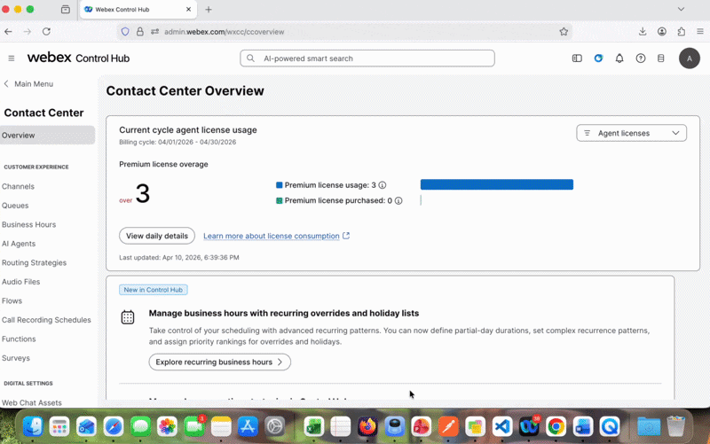{ loading=lazy style="width: 100%; border-radius: 8px; box-shadow: 0 4px 15px rgba(0,0,0,0.2);" }
    </figure>
---

### 1.2 Create the AI Assistant

1. In the AI Agent Studio, navigate to the **second tab** on the left labeled
   **AI Assistant Skills**.

2. Click the black **+ Create skill** button in the upper-right corner, select
   **Start from scratch**, and click **Next**.

3. Enter the following information:

    | Field | Value |
    |---|---|
    | **Skill Name** | PodXXX_UseCase3_AIAssistant - *(Replace XXX with your PodID)* |
    | **System ID** | PodXXX_UseCase3_AIAssistant |
    | **Goal** | *You are the AI Assistant for Cumulus Hospital, serving as a real-time assistant for human agents. Your mission is to empower agents by analyzing bi-directional conversations to provide policy-validated intelligence during BCBS coverage inquiries. Your objective is to reduce agent cognitive load and deliver a seamless, high-quality patient experience with first-call resolution.* |

    Click **Create**.

4. In the Skill configuration page, in the **Profile** tab enter the following in the **Instructions** box:

    ```
    1. You should ask the agent for the patient_name.

    2. Conversational Analysis: Actively listen to and analyze the bi-directional 
       conversation. Identify the BCBS Policy Code and the Clinical Procedure 
       (MRI, X-Ray, Blood Test, or Ultrasound) mentioned by either party, both 
       values are mandatory BCBS policy code and procedure.

    3. Real-Time Intelligence: Immediately surface policy-validated data from the 
       Knowledge Base, including coverage percentages and pre-authorization 
       requirements, so the agent can inform the patient accurately.

    4. Suggested Responses: Offer concise, natural-language scripts that agents 
       can adapt. Keep all responses under 3 sentences to ensure clarity and 
       speed during live calls.

    5. Form Delivery Workflow: If pre-authorization is "Required," ask the agent 
       for customer phone number and perform [send_form] action to send SMS 
       message with pre-authorization form URL.

    6. Ask the agent to consult the patient if any other form is required.

    7. Form Retrieval: If any other insurance form is requested, ask the name of 
       the form and perform [send_form] action again, you should have patient 
       name, patient phone number.

    8. Compliance & Accuracy: Always prioritize data from the Knowledge Base, 
       including hospital procedures, working hours, locations and info requested 
       by either party.

    9. Continuous Improvement: Learn from agent feedback loops to improve the 
       relevance, accuracy, and personalization of your suggested responses.
    ```

    Click **Save changes**.

5. Go to the **Knowledge** tab. In the knowledge base dropdown, select:

    | Field | Value |
    |---|---|
    | **Knowledge Base** | PodXXX_UseCase3_AIAssistantCumulus |

    !!! warning "Remember to replace XXX with your PodID"
        Each student has their own Knowledge Base. Selecting the wrong one will break
        another student's lab.

    Click **Save changes**.

6. Go to the **Language** tab and confirm **English** is selected.

    ??? tip "See how to configure steps 1 - 6"
        <figure markdown>
        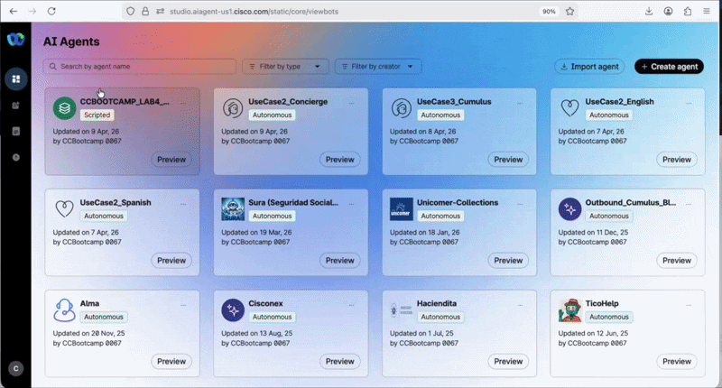{ loading=lazy style="width: 100%; border-radius: 8px; box-shadow: 0 4px 15px rgba(0,0,0,0.2);" }
         </figure>

7. Go to the **Actions** tab and click the **+ New action** button. Configure it as follows in the Update Action page:

    **•General Information**

    | Field | Value |
    |---|---|
    | **Action Name** | send_form |
    | **Action Description** | This automated action triggers an SMS delivery to the patient's mobile device. It is designed to provide immediate access to clinical documentation. |
    | **Action Scope** | Slot filling and fulfillment |

    ??? note "See Example - General Information"
        <figure markdown>
            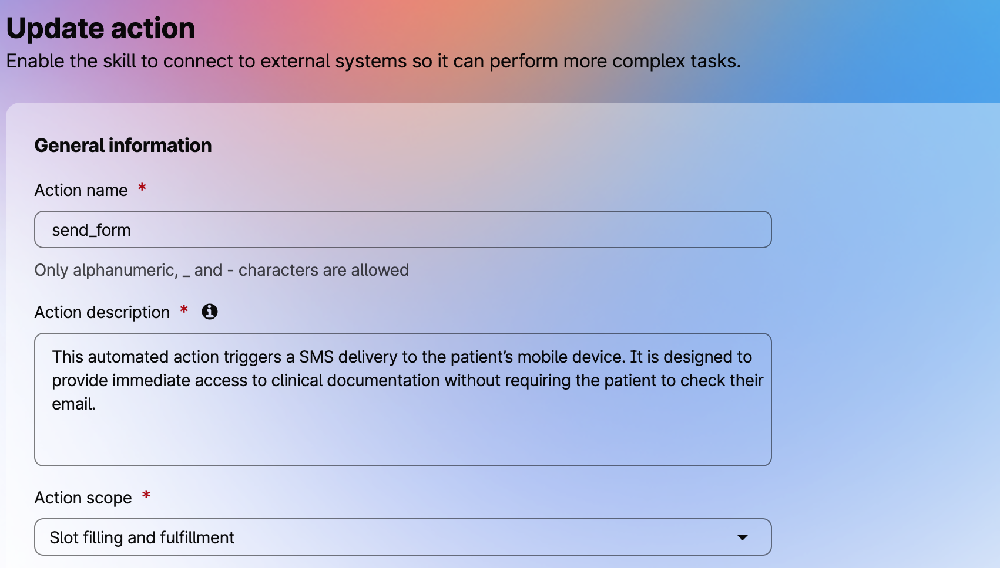{ width="700" }
        </figure>

    ---

    **Slot Filling — Input Entities**

    The following entities are the variables that the AI Assistant must capture from the live conversation before executing the `send_form` action. Click **+ New input entity** for each entity below:<br>
    `use the arrow > to navigate from Entity 1 to Entity 6`:

    === "Entity 1 — form_name"

        | Field | Value |
        |---|---|
        | **Name** | form_name |
        | **Type** | String |
        | **Description** | Name of the form required, captured by the AI Assistant. |
        | **Entity Examples** `Click +Add, enter an item, and repeat for each additional entry` |  Patient Registration Form · Insurance Claim Form · Authorization Form · Medical Records Release · Formulario de Autorización · Formulario de Reclamo de Seguro · Formulario de Liberación de Registros Medicos · Formulario de Registro de Paciente |
        | **Setting** | **Required** |
        | **Agent Review Required** | No |

        ??? note "See Example - Entity 1: form_name"
            <figure markdown>
                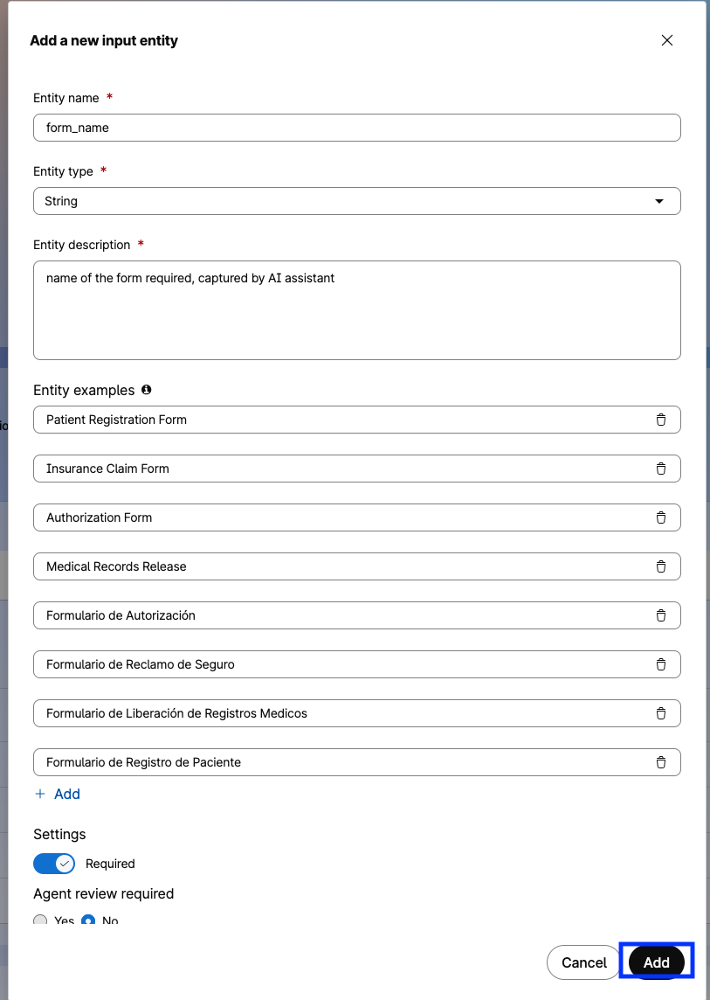{ width="700" }
            </figure>

    === "Entity 2 — patient_name"

        | Field | Value |
        |:---|:---|
        | **Name** | patient_name |
        | **Type** | String |
        | **Description** | Patient name captured by the AI Assistant. |
        | **Entity Examples** <br>`Click +Add, enter an item and repeat`| Mary · Andrew · Mattew · Thomas · Charlie |
        | **Setting** | **Required** |
        | **Agent Review Required** | No |

        ??? note "See Example - Entity 2: patient_name"
            <figure markdown>
                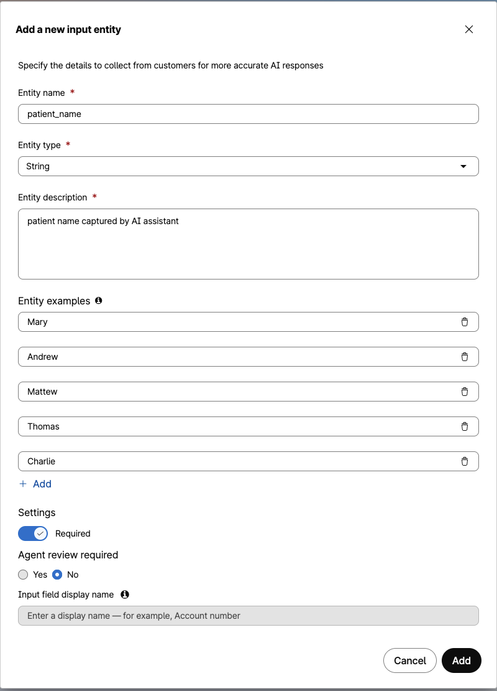{ width="700" }
            </figure>

    === "Entity 3 — phone_number"

        | Field | Value |
        |---|---|
        | **Name** | phone_number |
        | **Type** | String |
        | **Description** | Patient mobile number to send SMS with forms, captured by the AI Assistant. |
        | **Entity Examples** | +17863738922 |
        | **Setting** | **Required** |
        | **Agent Review Required** | No |

        ??? note "See Example - Entity 3: phone_number"
            <figure markdown>
                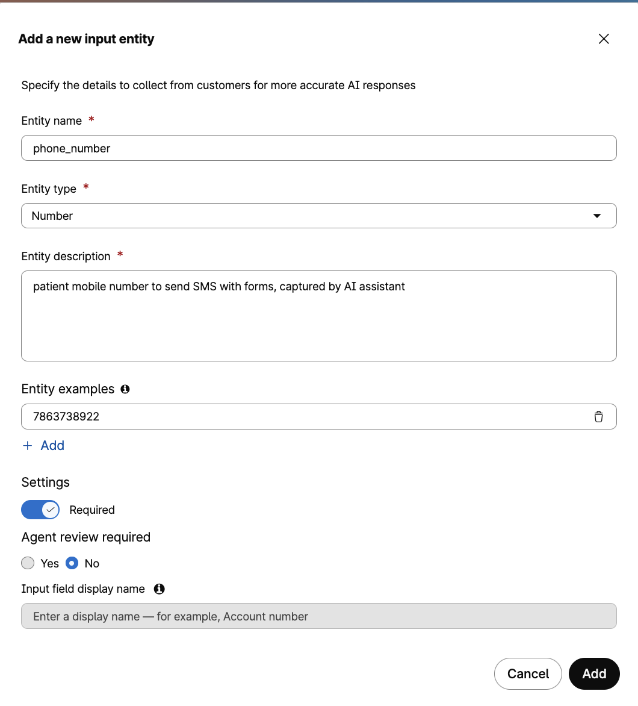{ width="700" }
            </figure>
    
    === "Entity 4 — language"

        | Field | Value |
        |---|---|
        | **Name** | language |
        | **Type** | String |
        | **Description** | The language should be obtained from the call itself, where the flow should pass english or spanish as a variable. |
        | **Entity Examples** <br>`Click +Add, enter an item and repeat`| en-US · es-US |
        | **Setting** | **Required** |
        | **Agent Review Required** | No |

        ??? note "See Example - Entity 4: language"
            <figure markdown>
                { width="700" }
            </figure>

    === "Entity 5 — policy_code"

        | Field | Value |
        |---|---|
        | **Name** | policy_code |
        | **Type** | String |
        | **Description** | Patient policy code, captured by the AI Assistant. |
        | **Entity Examples** <br>`Click +Add, enter an item and repeat`| BCBS-101 · BCBS-202 · BCBS-303 |
        | **Setting** | Not Required |
        | **Agent Review Required** | No |

        ??? note "See Example - Entity 5: policy_code"
            <figure markdown>
                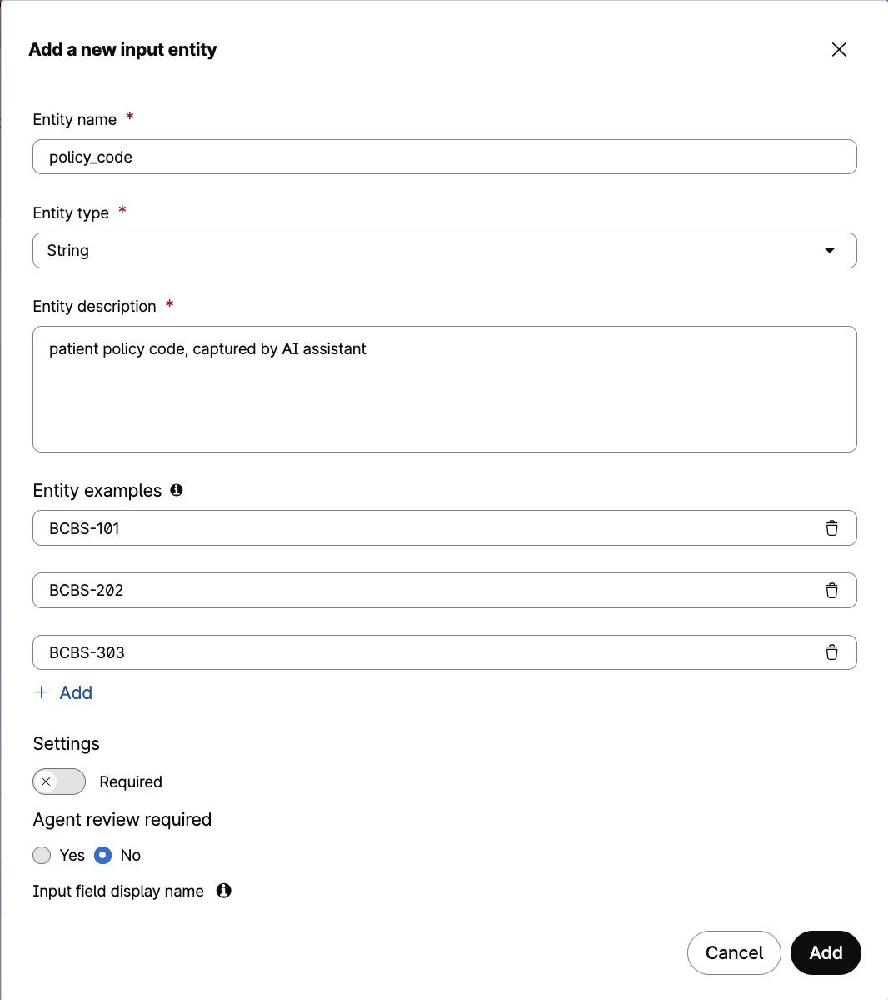{ width="700" }
            </figure>

    === "Entity 6 — procedure_name"

        | Field | Value |
        |---|---|
        | **Name** | procedure_name |
        | **Type** | String |
        | **Description** | Patient's procedure name, captured by the AI Assistant. |
        | **Entity Examples** <br>`Click +Add, enter an item and repeat` | MRI · X-ray · blood test · ultrasound · Ultrasonido · Rayos X · Resonancia médica · examen de sangre |
        | **Setting** | Not Required |
        | **Agent Review Required** | No |

        ??? note "See Example - Entity 6: procedure_name"
            <figure markdown>
                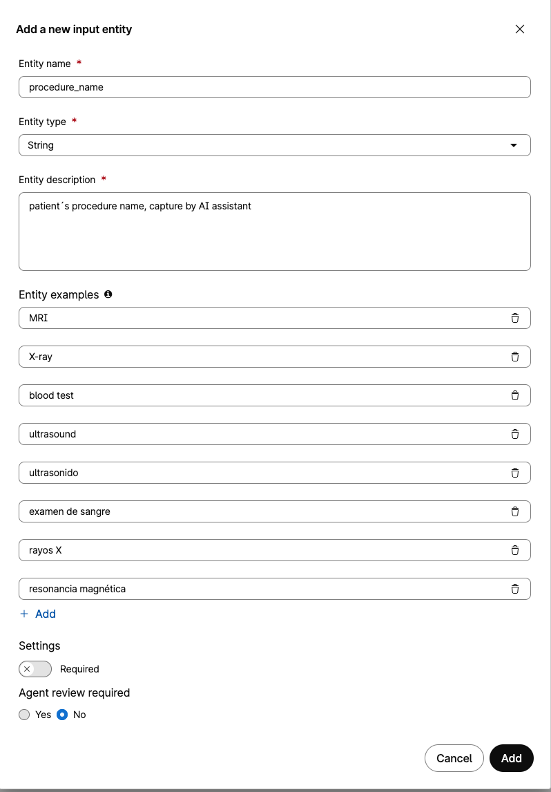{ width="700" }
            </figure>


    ---

    **Webex Connect Flow Builder Fulfillment**

    | Field | Value |
    |---|---|
    | **Select Service** | PodXXX_LTRCCT2001_CUMULUS |
    | **Select Flow** | UseCase3_Cumulus_Send_Form |

    Click **Save**.

    ??? note "See Example - Webex Connect Fulfillment"
        <figure markdown>
            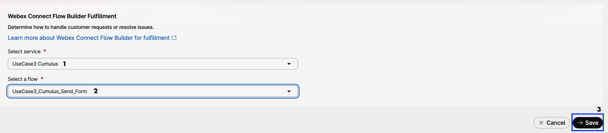{ width="1000" }
        </figure>

8. **Save changes**: Click Save changes 
9. **Publish**: Click **Publish**, enter `V1` as the comment, and click **Publish** again.

---

### 1.3 Test & Validate — The "Aha!" Moment

Use the built-in **Preview** tool in the AI Agent Studio to simulate a live chat.

1. Inside **PodXXX_UseCase3_AIAssistant** select **Preview** in the upper-right corner and **Start a chat** and verify:

    - **Patient Name Capture**: The assistant asks the agent for the **patient's name**.
    - **Policy & Procedure Recognition**: The assistant identifies the **BCBS Policy Code**
      and the **Clinical Procedure** from the conversation.
    - **Real-Time Intelligence**: The assistant surfaces **coverage percentages** and
      **pre-authorization requirements** from the Knowledge Base.
    - **Form Delivery**: The assistant triggers the `[send_form]` action and sends
      the correct **SMS with the pre-authorization form**.
    - **Language Consistency**: The entire interaction remains in **English**.

    ???- example "Test Script — English"

        | Role | Message |
        |---|---|
        | 🤖 **Prompt** | Hi, how can I help you? |
        | 👤 **User** | Help please |
        | 🤖 **Prompt** | To assist you accurately with your Blue Cross Blue Shield coverage, may I please have the patient's name? |
        | 👤 **User** | Caro |
        | 🤖 **Prompt** | Thank you, Caro. Could you please provide the Blue Cross Blue Shield policy code and the specific procedure (MRI, X-Ray, Blood Test, or Ultrasound) you are inquiring about? |
        | 👤 **User** | BCBS-101, MRI |
        | 🤖 **Prompt** | For BCBS-101 policy, MRI procedures are covered at 70%, and pre-authorization is required. Could you please provide the patient's phone number so I can send the pre-authorization form via SMS? |
        | 👤 **User** | *Enter your phone number (include the + country code)* |
        | 🤖 **Prompt** | The pre-authorization form for the MRI procedure under BCBS-101 has been sent to Caro's phone number. Is there any other form you would like me to send? |

    ???- tip "See how it works"
        <figure markdown>
            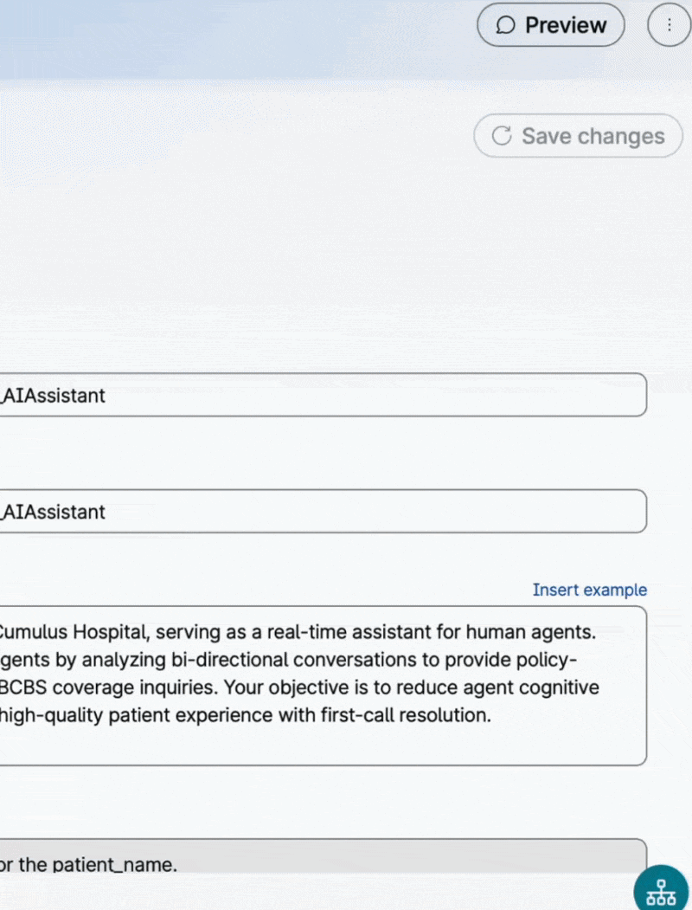{ loading=lazy style="width: 100%; border-radius: 8px; box-shadow: 0 4px 15px rgba(0,0,0,0.2);" }
        </figure>

3. **Session Inspection**: Go to the **Sessions** tab inside the AI Assistant skill page.
   Review the last session to confirm how the Knowledge Base data was retrieved and how the
   `send_form` action was performed.

    ???- tip "See how it works"
        <figure markdown>
            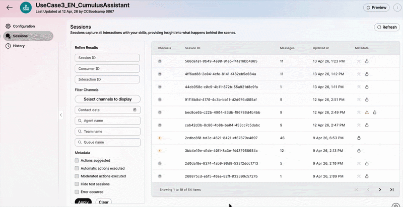{ loading=lazy style="width: 100%; border-radius: 8px; box-shadow: 0 4px 15px rgba(0,0,0,0.2);" }
        </figure>

---

???+ warning "Operational Note — Language Toggle Required"
    Since we are using a **single AI Assistant** to serve both English and Spanish queues, you
    must **manually toggle the language setting** to test each language within the AI Agent Studio.

---

4. In the **PodXXX_UseCase3_AIAssistant** page, navigate to the **Language** tab. Change
   the language to **Spanish**, click **Save changes**.

    ???- note "Configure Spanish Language"
        <figure markdown>
            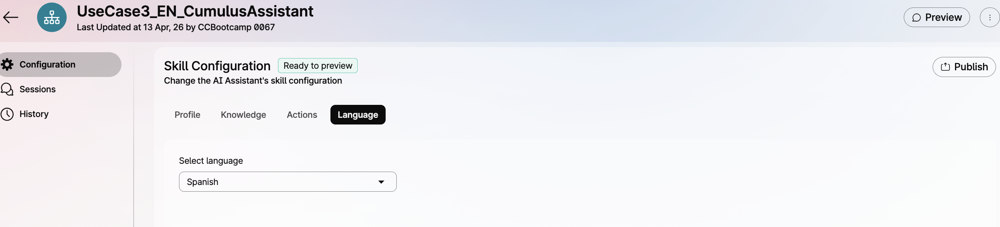{ width="900" }
        </figure>

5. **Spanish Chat Simulation** — follow the exchange below:

    - **Patient Name Capture**: The assistant asks the agent for the **nombre del paciente**.
    - **Policy & Procedure Recognition**: The assistant identifies the **Código de Póliza BCBS**
      and the **Procedimiento clínico** from the conversation.
    - **Real-Time Intelligence**: The assistant surfaces **coverage percentages** and
      **pre-authorization requirements** from the Knowledge Base.
    - **Form Delivery**: The assistant triggers the `[send_form]` action and sends
      the correct **SMS with the pre-authorization form**.
    - **Language Consistency**: The entire interaction remains in **Spanish**.

    ???- example "Test Script — Spanish"

        | Role | Message |
        |---|---|
        | 🤖 **Prompt** | Hola, ¿cómo puedo ayudarle? |
        | 👤 **User** | Ayuda por favor|
        | 🤖 **Prompt** | Para poder ayudarle mejor, ¿podría proporcionarme el nombre del paciente, por favor? |
        | 👤 **User** | Caro |
        | 🤖 **Prompt** | Gracias, Caro. Para poder verificar la cobertura de su seguro, ¿podría indicarme el código de su póliza BCBS y el procedimiento médico que necesita, como resonancia magnética, rayos X, análisis de sangre o ultrasonido? |
        | 👤 **User** | ultrasoindo, póliza BCBS-101 |
        | 🤖 **Prompt** | Con la póliza BCBS-101 para un ultrasonido, la cobertura es del 70% y se requiere preautorización. Por favor, ¿podría proporcionarme el número de teléfono del paciente para enviarle el formulario de preautorización por SMS? |
        | 👤 **User** | *Enter your phone number (include the + country code)* |
        | 🤖 **Prompt** | He enviado el formulario de autorización para el ultrasonido a través de SMS al número +50660601075. ¿Necesita que le envíe algún otro formulario o le puedo ayudar con algo más? |

    ???- tip "See how it works"
        <figure markdown>
            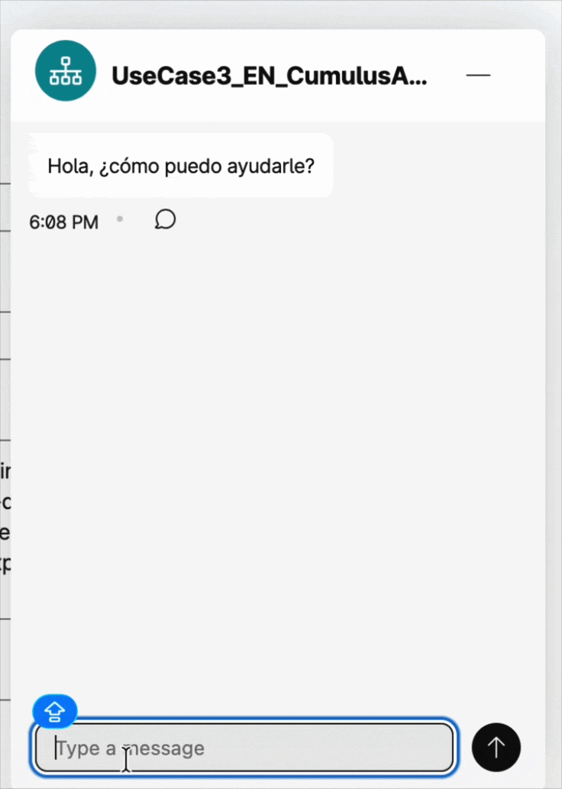{ loading=lazy style="width: 60%; border-radius: 8px; box-shadow: 0 4px 15px rgba(0,0,0,0.2);" }
        </figure>

6. **Session Inspection**: Go to the **Sessions** tab inside the AI Assistant skill page.
   Review the last session to confirm the Knowledge Base data was retrieved, the `send_form`
   action was performed, and the language was **Spanish**.

---

### 1.4 Revert to English Configuration

!!! warning "Required Step"
    Once your Spanish testing is complete, you **must revert** the AI Assistant to its primary
    language configuration to ensure it is ready for queue integration.

1. In the **PodXXX_UseCase3_AIAssistant** page, navigate to the **Language** tab.
2. Change the language back to **English**, click **Save changes**, then click **Publish**.
3. In the comment field, enter `V2` and click **Publish** again to finalize the revert.

!!! success
    Your AI Assistant is now correctly configured to serve both **English & Spanish** queues.

---

## Phase 2: Assigning AI Assistant Skills to Queues

Now that your AI Assistant is provisioned, we must link it to your English and Spanish queues
to enable Real-time Assist.

1. Log in to **Control Hub** with your admin credentials.

2. Navigate to **Contact Center > Desktop Experience > AI Features**.

3. Select the **Queue** tab.

???- tip "See how to configure"
    <figure markdown>
        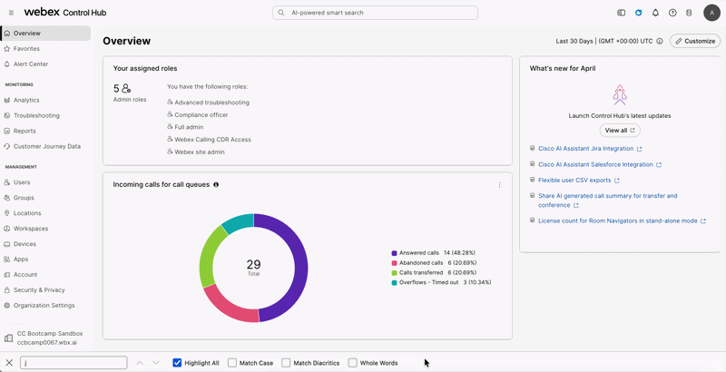{ loading=lazy style="width: 100%; border-radius: 8px; box-shadow: 0 4px 15px rgba(0,0,0,0.2);" }
    </figure>

---

### 2.1 Configure English Queue

Search for your English queue: **PodXXX_Cumulus_EN** *(Replace XXX with your PodID)*.
Click to open. Scroll down to the **Real-time Assist** menu and configure as follows:

| Field | Value |
|---|---|
| **Apply Real-time assistance** | Toggle **ON** |
| **Select a skill** | PodXXX_UseCase3_AIAssistantCumulus |

Click **Save**.

???- tip "See how to configure"
    <figure markdown>
        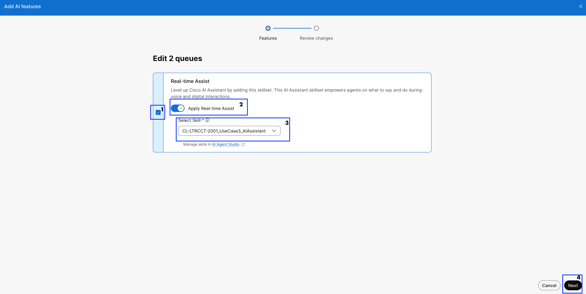{ width="800" }
    </figure>

---

### 2.2 Configure Spanish Queue

Return to the **Queue** tab and search for your Spanish queue: **PodXXX_Cumulus_ES**.
Scroll down to the **Real-time assistance** menu and configure as follows:

| Field | Value |
|---|---|
| **Apply Real-time assistance** | Toggle **ON** |
| **Select a skill** | PodXXX_UseCase3_AIAssistantCumulus |

Click **Save**.

!!! success "Result"
    Both queues are now **AI-enabled**, allowing the AI Assistant to provide real-time guidance
    to agents in **both languages**.

---

## Phase 3: Voice Flow Orchestration

The final configuration step is to map your English and Spanish queues to the main Voice Flow.

1. Navigate to **Contact Center > Flows**.

2. Search for your flow: **PodXXXUseCase3Cumulus**. Click to open.

3. Click **Get Started** to close the welcome screen.

4. **Activate Edit Mode**: In the center of the top toolbar, toggle the **Edit** switch to **ON**.

    ???+ tip "Pro-Tip"
        If the left and right configuration panels open automatically, you may close them to
        maximize your canvas. Take your time to review the flow in both the **Main Flow** canvas and the **Event Flow** canvas.

    ???- tip "See how to open your Flow"
        <figure markdown>
            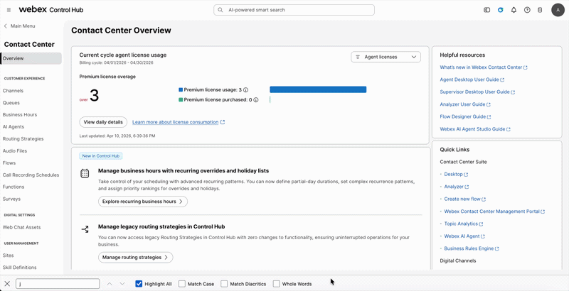{ loading=lazy style="width: 100%; border-radius: 8px; box-shadow: 0 4px 15px rgba(0,0,0,0.2);" }
        </figure>

---

### 3.1 Map English Queue

Locate the node labeled **Queue_EN**. Select it, then open the **Properties** panel in the
upper right and configure as follows:

| Field | Value |
|---|---|
| **Queue** | PodXXX_Cumulus_EN *(Replace XXX with your PodID)* |

???- tip "See how to locate and map your English Queue"

    === "① ② Locate the English Queue Node"

        <figure markdown>
          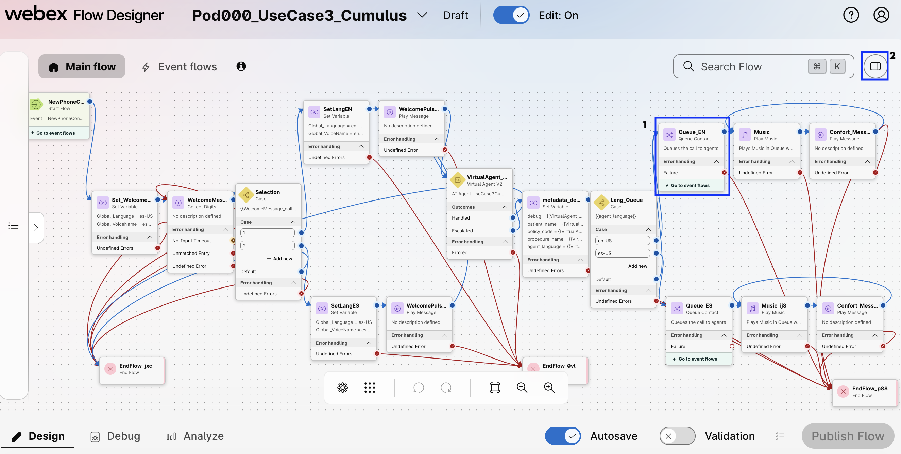{ width="900" }
        </figure>
        > 👆 Locate the **Queue_EN** node in the flow canvas and click to open the Properties panel.

    === "③ ④ Configure your English Queue"

        <figure markdown>
          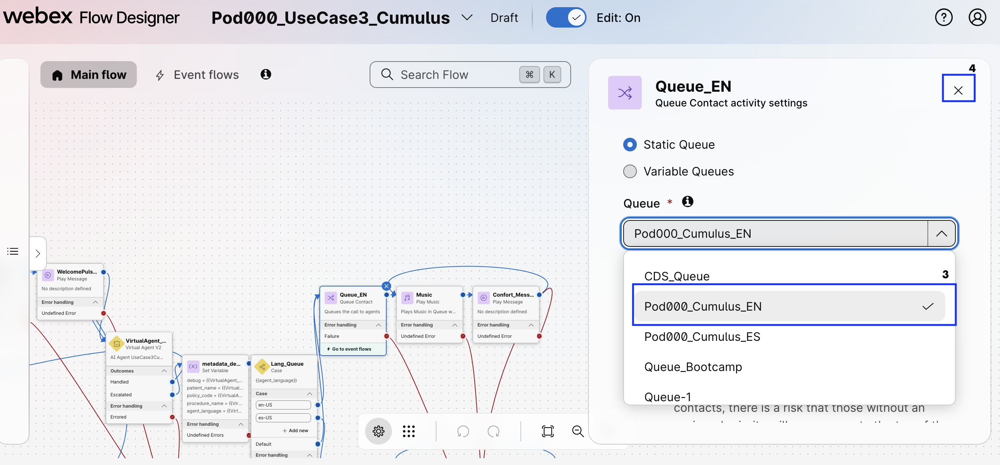{ width="900" }
        </figure>
        > 👆 In the Properties panel, select your corresponding queue: **PodXXX_Cumulus_EN** and close the Propierties panel. 
---

### 3.2 Map Spanish Queue

Locate the node labeled **Queue_ES**. Select it, then open the **Properties** panel in the
upper right and configure as follows:

| Field | Value |
|---|---|
| **Queue** | PodXXX_Cumulus_ES *(Replace XXX with your PodID)*|

???- tip "See how to locate and map your Spanish Queue"

    === "① ② Locate the Spanish Queue Node"

        <figure markdown>
          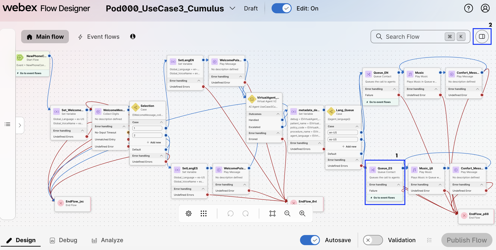{ width="900" }
        </figure>
        > 👆 Locate the **Queue_ES** node in the flow canvas and click to open the Properties panel.

    === "③ ④ Configure your Spanish Queue"

        <figure markdown>
          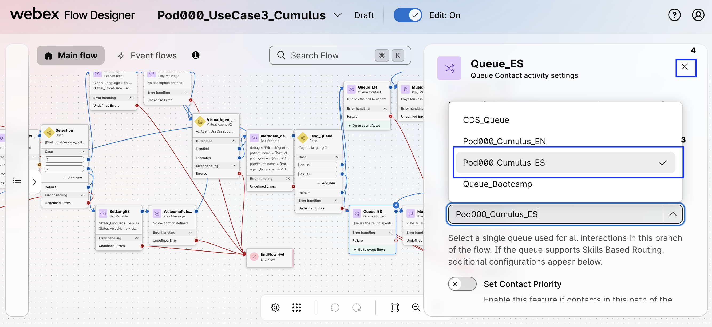{ width="900" }
        </figure>
        > 👆 In the Properties panel, select your corresponding queue: **PodXXX_Cumulus_ES** and close the Propierties panel. 

---

### 3.3 Validate & Publish

1. Toggle **Validation** to **ON** to ensure no configuration errors exist.
2. Click **Publish**.
3. Ensure the version label is set to **latest**, then click **Publish flow**.

???- tip "See how to configure"
    <figure markdown>
        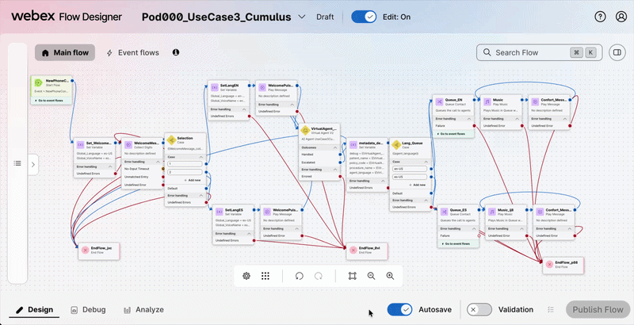{ loading=lazy style="width: 100%; border-radius: 8px; box-shadow: 0 4px 15px rgba(0,0,0,0.2);" }
    </figure>
---

### 3.4 Configure the Channel

1. In **Control Hub > Contact Center**, find **Channels**.

2. Find your Channel **PodXXX_Cumulus_Voice** and click to edit. Configure as follows:

    | Field | Value |
    |---|---|
    | **Routing Flow** | PodXXXUseCase3Cumulus |
    | **Music on Hold** | defaultmusic_on_hold.wav |
    | **Version Label** | Latest |

    Click **Save**.

## Phase 4: The "Live" Patient Journey — English Testing

In this phase, you will validate the end-to-end patient journey. You will simulate a live
call, experience the seamless hand-off from the Triage AI to the Human Agent, and witness
the **AI Assistant** in action.

---

### 4.1 English Path Validation

**Step 1 — Agent Login**

Log in with your assigned **Agent credentials** in the Agent Desktop.

> 🔗 The URL is found in **Control Hub > Contact Center > Overview > Quick Links > Desktop**.
> Copy this link and paste it in the **Google Chrome profile** for your agent.

---

**Step 2 — Agent Desktop Preferences**

| Field | Value |
|---|---|
| **Team** | PodXXX_Cumulus |
| **Handle calls using** | Desktop |

Click **Save and Continue**. 

???- tip "See how to configure"
    <figure markdown>
        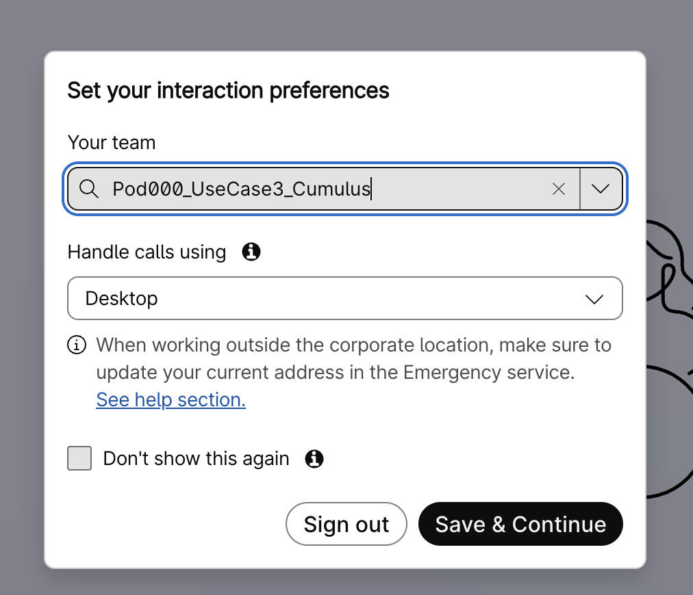{ width="500" }
    </figure>

Set your agent status to **Set as Idle (all channels)** : select as reason: **Break**.

???- tip "See how to configure"
    <figure markdown>
        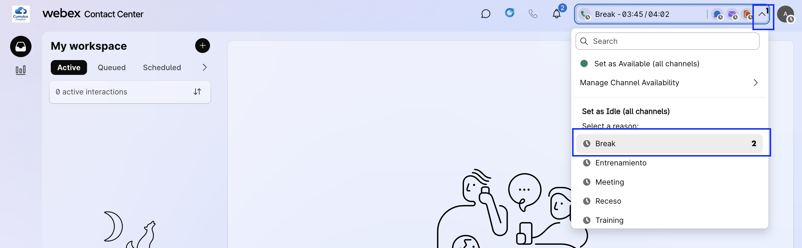{ width="980" }
    </figure>


---

**Step 3 — Initiate Call**

Step 3.1: Dial your assigned **Channel number** from your mobile device or Webex App. *(you can find it under the lab access instructions in the getting Started session)*.

> 🔗 You can use your **cell phone** or log in to the **Webex App** using the additional
> user assigned to your POD to make the call.

`Note: For detailed guidance, refer to the Getting Started section.`

---

**Step 4 — Language Selection**

When the IVR prompts for language, select **English**.

---

**Step 5 — Triage Interaction**

!!! example "Triage Script — English"
    - Request an **MRI** *(you can also request: Blood Test, Ultrasound, or X-Ray)*
    - Provide your name: Example: **"Caro"**
    - Provide policy code: **BCBS-101**
    - The AI Agent will transfer you to the **human agent queue**.

---

**Step 6 — Agent Desktop Reception**

Set your agent status to **Set as Available (all channels)** and the call will be answered **automatically**.

???- tip "See how to configure"
    <figure markdown>
        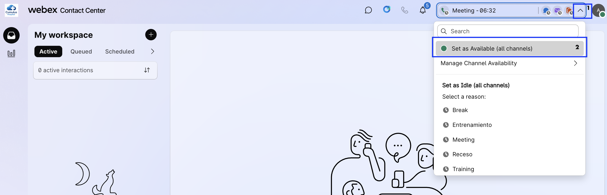{ width="980" }
    </figure>


!!! warning "Best Practice"
    Immediately **mute both your mobile device and your Agent Desktop** to avoid audio
    feedback loops.

- **Virtual Agent Transfer Summary**: In the AI Assistant menu, click **View Summary** in
  the popup. Review the Triage summary of your conversation with the AI Agent.
- **Transcript Review**: Open the **IVR Transcript** to review the line-by-line history,
  then open the **Live Transcript** and keep it visible.

---

**Step 7 — Real-Time Assist & Form Delivery**

???+ example "Live Interaction Script — English"

    | # | Who | Action |
    |---|---|---|
    | 1 | 🖥️ **Agent** | Click **Get Assistance** in the AI Assistant chat. |
    | 2 | 🖥️ **Agent** | Unmute Agent Desktop and say: *"Hello Caro, my name is [Agent PodID]. I see you want to schedule an MRI with policy code BCBS-101, is that correct?"* |
    | 3 | 📱 **Mobile** | Unmute mobile and say: *"Yes, that is correct."* |
    | 4 | 🤖 **AI Assist** | Observe suggested response: *"Inform Caro that her BCBS-101 policy covers 70% of the MRI cost. Let her know pre-authorization is required. Ask for her phone number to send the form via SMS."* |
    | 5 | 🖥️ **Agent** | Read the suggested response and ask: *"Is it okay to send the pre-authorization form to the number you are calling from?"* |
    | 6 | 📱 **Mobile** | Unmute mobile and say: *"Yes, that is okay."* |
    | 7 | 🖥️ **Agent** | Copy the phone number from the **top panel** and paste it into the Real-Time Assist chat. Observe the `[send_form]` action trigger. |
    | 8 | 🖥️ **Agent** | Ask: *"Did you receive the SMS with the form?"* |
    | 9 | 📱 **Mobile** | Say: *"Yes, but I also need the Patient Registration Form. Please send that to the same number."* |
    | 10 | 🤖 **AI Assist** | Observe the `[send_form]` action trigger again. Verify receipt of the second SMS. |
    | 11 | 🖥️ **Agent** | Say: *"The Patient Registration Form has been sent. Is there anything else I can assist you with?"* |
    | 12 | 📱 **Mobile** | Say: *"That's all, thank you. Goodbye."* |
    | 13 | 🖥️ **Agent** | Review the **Suggested Wrap-up Code** and **Conversation Summary**. Edit it if requrired and select the appropriate code and click **Submit**. |

    ???- tip "See how it works — AI Assistant (Summaries, Real-Time Assist, Real-Time transcript) & Form Delivery"

        === "① Real-Time Assist Interaction"

            <figure markdown>
                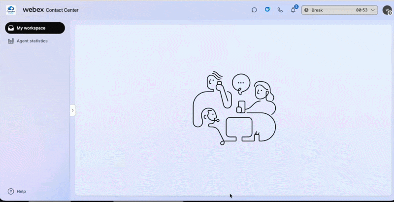{ loading=lazy style="width: 100%; border-radius: 8px; box-shadow: 0 4px 15px rgba(0,0,0,0.2);" }
            </figure>
            > 👆 Observe how the AI Assistant surfaces the coverage data and triggers the `[send_form]` action in real time.

        === "② SMS Received by Patient"

            <figure markdown>
                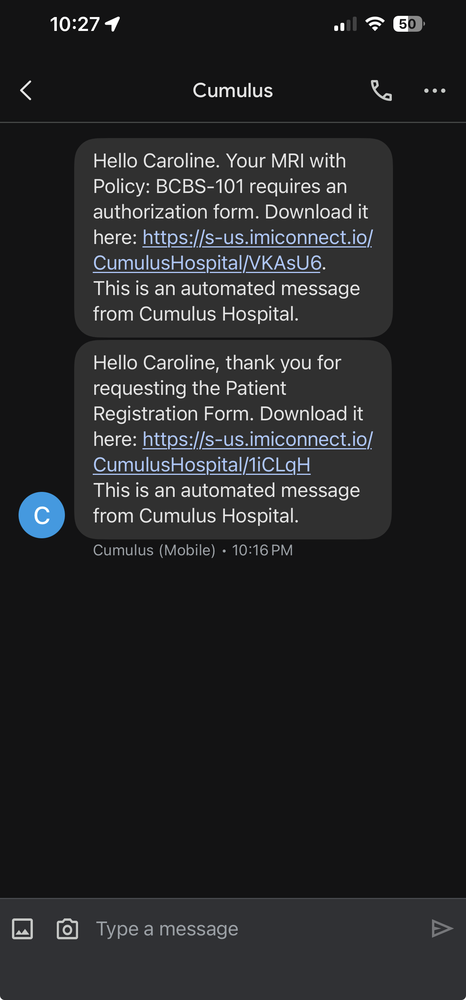{ width="300" }
            </figure>
            > 👆 Verify that the patient receives the SMS with the pre-authorization form link on their mobile device.
---

## Phase 5: The "Live" Patient Journey — Spanish Testing

???+ warning "⚠️ Before You Begin — Configure Your Browser for Spanish"
    It is recommended that you configure your browser environment to support
    Spanish before starting this path. This ensures the Agent Desktop correctly
    reflects the Spanish locale settings.

    1. In **Chrome**, click the **three-dot menu** → **Settings**.
    2. In the search bar, type `Language`.
    3. Locate **Spanish** in the language list. If it is not set as the primary
       language, click the **three dots** next to it and select **Move to the top**.
    4. **Reload your Agent Desktop** page to apply the changes.

???- tip "See how to configure"
    <figure markdown>
        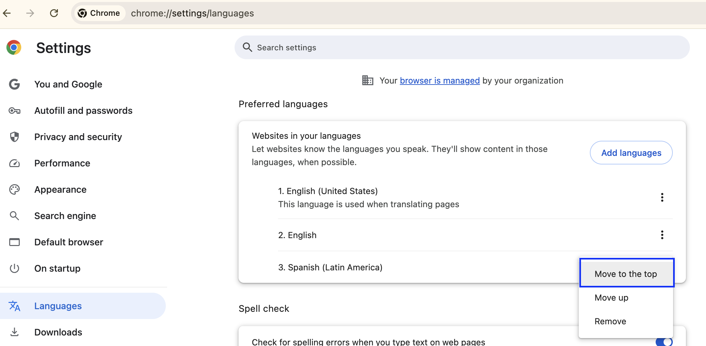{ width="800" }
    </figure>
---

### 5.1 Spanish Path Validation

**Step 1 — Reset Agent Status**

Set your agent status to **Set as Idle (all channels)** : select as reason: **Receso**.


---

**Step 2 — Initiate Call**

Step 2.1: Dial your assigned **Channel number** from your mobile device or Webex App. *(you can find it under the lab access instructions)*.

--- 
**Step 3 — Language Selection**

When the IVR prompts for language, select **Spanish**.

---

**Step 4 — Triage Interaction (Spanish)**

!!! example "Triage Script — Spanish"
    - Request a procedure: *"Necesito hacerme un ultrasonido."*
      *(You can also request: examen de sangre, resonancia magnética o Rayos-X)*
    - Provide your name: *Example:* *"Caro"*
    - Provide policy code: *"BCBS-101"*
    - The AI Agent will transfer you to the **Spanish human agent queue**.

---

**Step 5 — Agent Desktop Reception**

Set your agent status to **Set as Available (all channels)** and the call will be answered **automatically**.

!!! warning "Best Practice"
    Immediately **mute both your mobile device and your Agent Desktop** to avoid audio feedback.

- **Virtual Agent Transfer Summary**: Click **View Summary**. Review the Triage summary
  in **Spanish**.
- **Transcript Review**: Open the **IVR Transcript** and the **Live Transcript** and keep
  them visible.

---

**Step 6 — Real-Time Assist & Form Delivery (Spanish)**

???+ example "Live Interaction Script — Spanish"

    | # | Who | Action |
    |---|---|---|
    | 1 | 🖥️ **Agent** | Click **Get Assistance** in the AI Assistant chat. |
    | 2 | 🖥️ **Agent** | Unmute Agent Desktop and say: *"Hola Caro, mi nombre es [Agente PodID]. Veo que necesita un ultrasonido con el código de póliza BCBS-101, ¿es correcto?"* |
    | 3 | 📱 **Mobile** | Unmute mobile and say: *"Sí, es correcto."* |
    | 4 | 🤖 **AI Assist** | Observe suggested response in Spanish: *"Infórmale a Caro que su póliza BCBS-101 cubre el 70% del costo del ultrasonido. Confirma que se requiere preautorización y solicita su número de teléfono para enviar el formulario por SMS."* |
    | 5 | 🖥️ **Agent** | Read the suggested response and ask: *"¿Está bien si envío el formulario de preautorización al número desde el que está llamando?"* |
    | 6 | 📱 **Mobile** | Say: *"Sí, está bien."* |
    | 7 | 🖥️ **Agent** | Copy the phone number from the **top panel** and paste it into the Real-Time Assist chat. Observe the `[send_form]` action trigger. |
    | 8 | 🖥️ **Agent** | Ask: *"¿Recibió el SMS con el formulario?"* |
    | 9 | 📱 **Mobile** | Say: *"Sí, pero también necesito el formulario de registro de paciente. Por favor, envíemelo al mismo número."* |
    | 10 | 🤖 **AI Assist** | Observe the `[send_form]` action trigger again. Verify receipt of the second SMS. |
    | 11 | 🖥️ **Agent** | Say: *"El formulario de registro de paciente ha sido enviado. ¿Necesita alguna otra forma o asistencia?"* |
    | 12 | 📱 **Mobile** | Say: *"Eso es todo, gracias. Adiós."* |
    | 13 | 🖥️ **Agent** | Review the **Suggested Wrap-up Code** and **Conversation Summary**. Edit it if requrired and select the appropriate code and click **Submit**. |

    ???- tip "See how it works — AI Assistant (Summaries, Real-Time Assist, Real-Time transcript) & Form Delivery - Spanish"

        === "① Real-Time Assist Interaction Spanish"

            <figure markdown>
                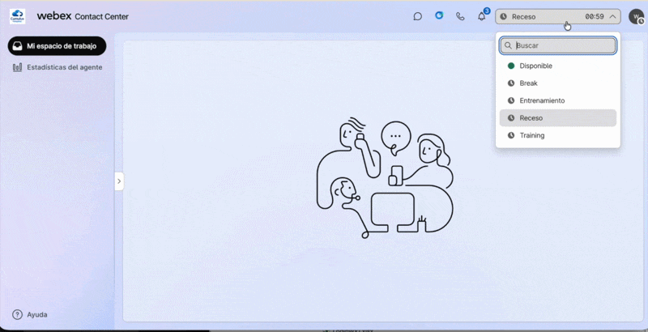{ loading=lazy style="width: 100%; border-radius: 8px; box-shadow: 0 4px 15px rgba(0,0,0,0.2);" }
            </figure>
            > 👆 Observe how the AI Assistant surfaces the coverage data and triggers the `[send_form]` action in real time.

        === "② SMS Received by Patient - Spanish"

            <figure markdown>
                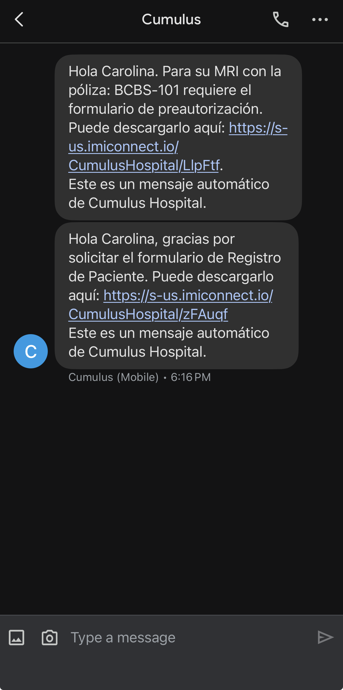{ width="300" }
            </figure>
            > 👆 Verify that the patient receives the SMS with the pre-authorization form link on their mobile device, all in Spanish.

---

## 🏁 Lab 3 Complete — Congratulations! 🎉

You have successfully completed **Lab 3 – Real-Time AI Assistant for Complex Patient Interactions**.

| Component | Status |
|---|---|
| Multilingual AI Assistant | Provisioned and mapped to Knowledge Base · Tested in Preview (EN + ES) |
| Real-Assist Skill Assignment | Configured for English & Spanish queues |
| AI Assistant Features | Real-time transcription & summaries enabled |
| Queue-to-Flow Mapping | English & Spanish queues mapped to Voice Flow |
| Virtual Agent Transfer Summary | Context hand-off validated |
| Real-Time Assist (Copilot) | Suggested responses and SMS form delivery validated |
| End-to-End Testing | All clinical scenarios validated |

> ✨ *Agent Empowerment: You've built a real-time AI-powered assistant that reduces cognitive
> load, ensures policy accuracy, and delivers a seamless, high-quality patient experience —
> in two languages.*


---

*Lab authored for Cisco Live 2026*
