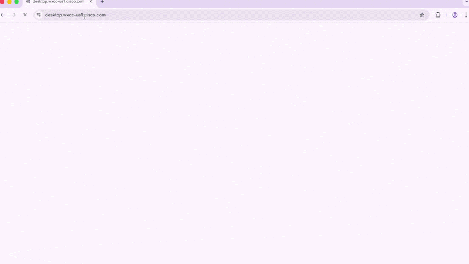
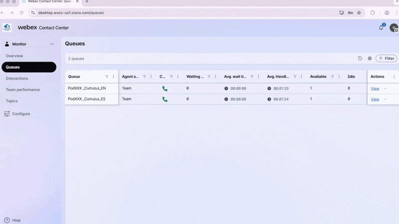
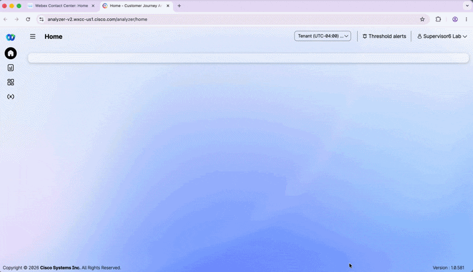
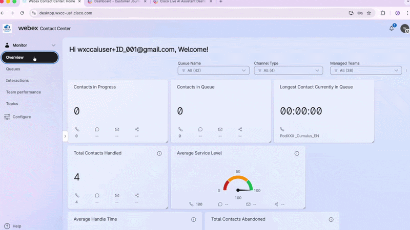
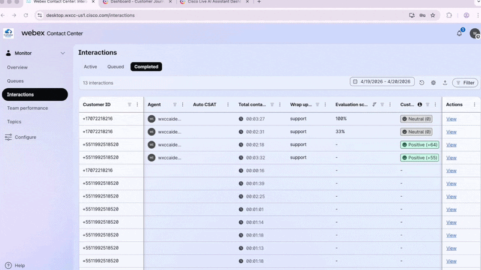
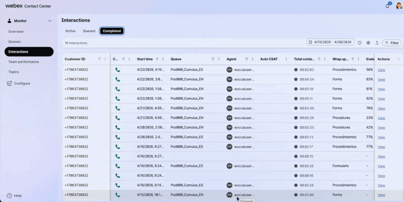
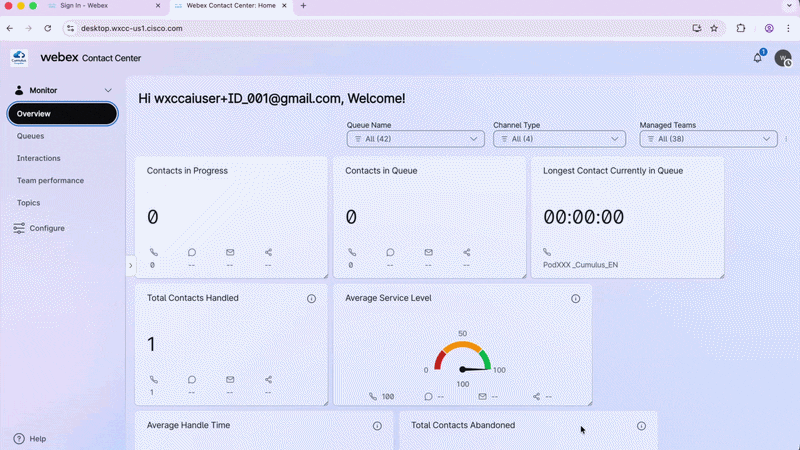
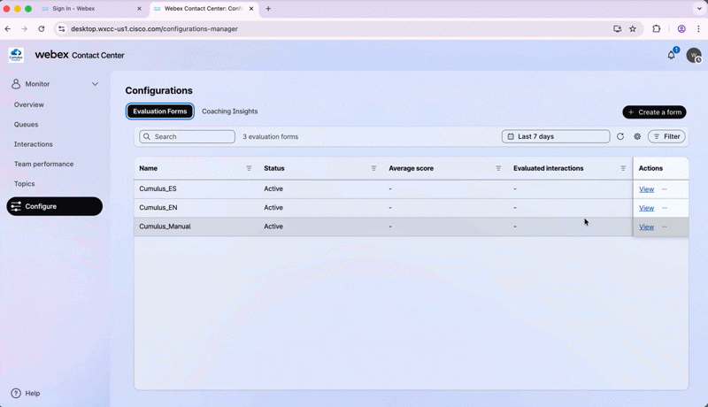
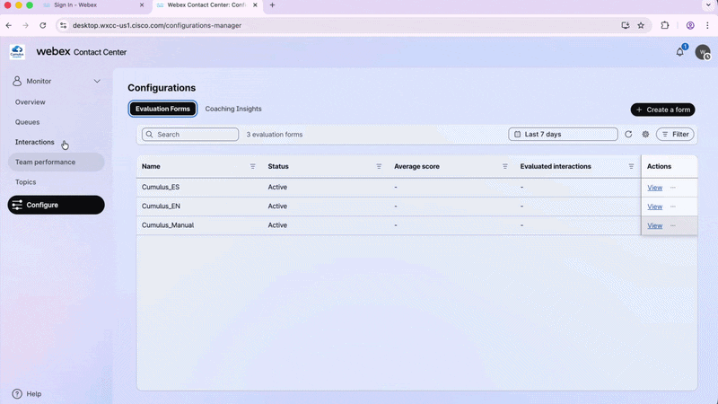
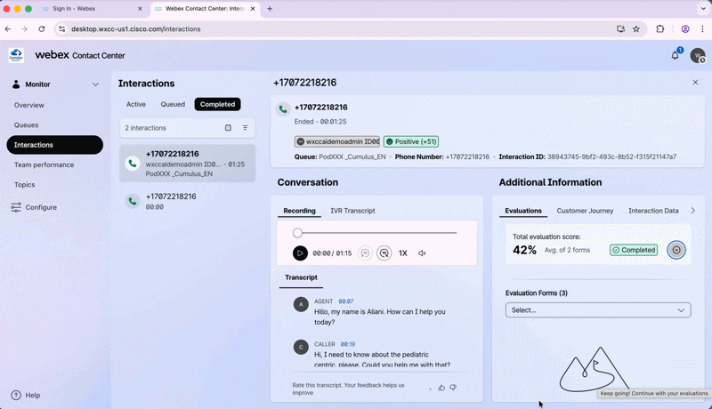

# Lab 4 - Bonus: AI Analytics & Quality Management for Supervisors

---

## Section Agenda - 15 Minutes
| # | Task | Duration |
|---|---|---|
| 1 | Phase 1 — Analyzing AI Assistant Dashboard | 5 min |
| 2 | Phase 2 — Analyzing Insights from Interactions with AI Quality Management | 10 min |

---

## Introduction

Now that you have successfully deployed and tested your AI Agent and AI Assistant, it is time
to transition into your role as a **Supervisor** and see **the full picture**. You will
evaluate interactions and analyze performance.

???+ info "Key Learning"
    The **AI Assistant Dashboard** gives you **real-time visibility** into AI usage and impact. <br>
    while **AI Quality Management** turns every interaction into a **coaching opportunity**, automatically, in any language, at scale.

???+ warning "The PodID Discipline"
    Always replace **XXX** with your assigned **3-digit ID (e.g., 001, 002)**. Your naming convention must start with the prefix **Pod** followed by your PodID **(PodXXX)**. If you do not follow this convention exactly, you will overwrite your neighbor's work. Stay disciplined with your naming convention!


## Phase 1 — Analyzing AI Assistant Dashboard

### 1.1 Launch the Supervisor Desktop

1. Open **Chrome** and select the **Supervisor_Lab** Chrome Profile.
2. Navigate to: 
```
https://desktop.wxcc-us1.cisco.com/
```
3. Log in with your **Supervisor POD credentials** and confirm:

    - **Role:** `Supervisor`
    - **Handle calls using:** `Desktop`

4. Click **Save & Continue**.

!!! tip "Save Your Password"
    Save the password on this Chrome Profile to make future logins easier during the lab.

???- info "See how to login"
    <figure markdown>
    { loading=lazy style="width: 100%; border-radius: 8px; box-shadow: 0 4px 15px rgba(0,0,0,0.2);" }
    <figcaption>Launching the Supervisor Desktop</figcaption>
    </figure>

---

### 1.2 Explore the Overview Dashboard

1. In the left panel, click **Overview**.
2. Scroll down and explore the operational KPIs available — Service Level, Handle Time,
   Queue details, and more.

---

### 1.3 Launch Analyzer

1. From the Overview Dashboard, click the **three dots (⋮)** and select **Go to Analyzer**.

A second Chrome tab will open with the **Analyzer** tool.

??? info "See how to launch Analyzer"
    <figure markdown>
    { loading=lazy style="width: 100%; border-radius: 8px; box-shadow: 0 4px 15px rgba(0,0,0,0.2);" }
    <figcaption>Accessing Analyzer from the Supervisor Desktop</figcaption>
    </figure>

---

### 1.4 Run the Cisco Live AI Assistant Dashboard

1. In the left panel, navigate to the **Dashboard** section.
2. Locate **Cisco Live AI Assistant Dashboard**, click the **three dots (⋮)** and select **Run**.
3. Set the Duration filter to **This Week**.

You will see all interactions from this lab that had **AI Assistant** running — Transcription
volume, Handle Time, and Calls with Suggested Responses.

???- info "See how it works"
    <figure markdown>
    { loading=lazy style="width: 100%; border-radius: 8px; box-shadow: 0 4px 15px rgba(0,0,0,0.2);" }
    <figcaption>Cisco Live AI Assistant Dashboard — This Week view</figcaption>
    </figure>

    ???+ tip "Explore the Filters"
        Filter by **TeamName**, **QueueName**, or queue language (EN/ES) to drill down into
        specific segments. Scroll right to explore all available metrics.

---

## Phase 2 — Analyzing Insights from Interactions with AI Quality Management

---

### 1.1 Review Completed Interactions

1. Go back to the **Supervisor Desktop**.
2. In the left panel, click **Interactions** → **Completed**.

!!! Important "New AI QM KPIs"
    | KPI | Description |
    |---|---|
    | **Evaluation Score** | Automated score assigned by AI QM from the interaction transcript |
    | **Customer Sentiment** | AI-detected customer sentiment throughout the interaction |

3. Click **Actions** to customize which KPIs are visible in this panel.
4. Filter and sort the columns as needed.

???- info "See how it works"
    <figure markdown>
    { loading=lazy style="width: 100%; border-radius: 8px; box-shadow: 0 4px 15px rgba(0,0,0,0.2);" }
    <figcaption>Completed Interactions panel with AI QM KPIs</figcaption>
    </figure>

---

### 1.2 — View an Individual Interaction (English)

1. Select one of your completed interactions and click **View**.
2. Review the full interaction detail: **Recording**, **IVR Transcription**,
   **Agent Transcript**, and **AI QM Evaluation**.

???- info "See how it works"   
    <figure markdown>
        { loading=lazy style="width: 100%; border-radius: 8px; box-shadow: 0 4px 15px rgba(0,0,0,0.2);" }
        <figcaption>Viewing the full detail of a completed interaction</figcaption>
    </figure>

---

### 1.3 — View an Individual Interaction (Spanish)

1. Repeat **Step 1.2** selecting a **Spanish interaction** from the Completed tab.

!!! warning "Early Preview Feature"
    Non-English evaluation is still an **Early Preview** feature. Spanish interactions may
    occasionally show inconsistencies in the AI QM evaluation output.

???- info "See how it works"
    <figure markdown>
    { loading=lazy style="width: 100%; border-radius: 8px; box-shadow: 0 4px 15px rgba(0,0,0,0.2);" }
    <figcaption>Viewing a completed Spanish interaction with AI QM evaluation</figcaption>
    </figure>

---

### 1.4 — Explore the Evaluation Forms

1. In the left panel, navigate to **Configure**.
2. Three Evaluation Forms were pre-created by the Proctors for this lab:

    | Form | Purpose |
    |---|---|
    | `Cumulus_EN` | Auto-evaluation for English interactions |
    | `Cumulus_ES` | Auto-evaluation for Spanish interactions |
    | `Cumulus_Manual` | Manual evaluation — no queue assigned |

3. Select **Cumulus_EN** and click **View**.
4. Review the evaluation questions, the values per question, and the **Form Assignment**.<br>
   *(Spanish queues → `Cumulus_ES` / English queues → `Cumulus_EN`)*.

!!! info "How Language is Determined"
    AI QM uses the **`Global_Language`** variable set in the voice flow. There is no
    auto-detected language — the variable must be explicitly configured in the flow.

!!! tip "Explore the Spanish Form"
    Repeat this step selecting **Cumulus_ES** to review the Spanish evaluation form.

???- info "See how it works"
    <figure markdown>
    { loading=lazy style="width: 100%; border-radius: 8px; box-shadow: 0 4px 15px rgba(0,0,0,0.2);" }
    <figcaption>Exploring the Cumulus_EN Evaluation Form and its queue assignment</figcaption>
    </figure>

---

### 1.5 — Explore the Manual Form

1. Still in **Configure**, click **Cumulus_Manual** and review this form.

!!! note "No Queue — No Automation"
    This form has no queue associated — no automated AI evaluation is performed using it.
    It is designed exclusively for **manual supervisor evaluations**.

???- info "See how it works"
    <figure markdown>
    { loading=lazy style="width: 100%; border-radius: 8px; box-shadow: 0 4px 15px rgba(0,0,0,0.2);" }
    <figcaption>Cumulus_Manual form — configured for manual evaluation only</figcaption>
    </figure>

---

### 1.6 — Perform a Manual Evaluation

1. Go back to **Interactions** → **Completed** and select one interaction. Click **View**.
2. Inside **Additional Information**, go to **Evaluation Forms**.
3. From the dropdown, select **Cumulus_Manual**.
4. Score each question based on the **transcript** or **recording** in the same panel.
5. Click **Submit**.

???- info "See how it works"
    <figure markdown>
    { loading=lazy style="width: 100%; border-radius: 8px; box-shadow: 0 4px 15px rgba(0,0,0,0.2);" }
    <figcaption>Performing a manual evaluation using the Cumulus_Manual form</figcaption>
    </figure>

---

### 1.7 — Review the Final Evaluation Score

1. Note that this interaction now shows a **different Evaluation Score** — calculated from
   **2 evaluations**: the Auto Evaluation + your Manual Evaluation.
2. Click the **Evaluations** tab inside **Additional Information** and expand the **arrow**
   to see each score individually.

???- info "See how it works"
    <figure markdown>
    { loading=lazy style="width: 100%; border-radius: 8px; box-shadow: 0 4px 15px rgba(0,0,0,0.2);" }
    <figcaption>Viewing combined Auto + Manual evaluation scores</figcaption>
    </figure>

!!! tip "More AI QM Features Available"
    Features like **Coaching** and **Sentiment Analysis** are also available on this tenant.
    We are limited on time — but come back next year to explore them together! 😄


## 🏁 Lab Complete — Congratulations! 🎉

You have successfully completed **Bonus Lab – **AI Analytics & Quality Management for Supervisors**.

| Component | Status |
|---|---|
| Supervisor Desktop | Launched and Overview Dashboard explored |
| AI Assistant Dashboard | Accessed in Analyzer and explored |
| Completed interactions | Reviewed with AI QM KPIs in English and Spanish |
| Evaluation Forms | Cumulus_EN, Cumulus_ES, and Cumulus_Manual explored |
| Manual evaluation | Performed and combined score reviewed |

---