# Lab 2 - AI Digital-First Multilingual Patient Journey 
---
## Section Agenda - 60 Minutes

| # | Task | Duration |
|---|---|---|
| 1 | Control Hub Foundation | 15 min |
| 2 | AI Agent Studio – The Digital Duo | 15 min |
| 3 | Webex Connect – Flow Orchestration | 15 min |
| 4 | Web Asset & W3Schools Simulation | 10 min |
| 5 | Final Testing | 5 min |

---

## Introduction

Welcome back, everyone. Imagine the scene: You've just landed in Las Vegas for Cisco Live.
The desert air is dry, your schedule is packed, and suddenly, you're feeling under the weather.
You need to visit the clinic, but you don't have time to wait on hold.
You need an insurance form, and you need it now.
This isn't just a lab; this is the future of patient care. Let's build it.

???+ info "Key Learning"
    Unlike voice, digital flows require **distinct agents per language** to maintain
    session integrity across the web widget.

???+ note "Section Independence"
    Section 2 is entirely independent of Section 1. We have pre-configured the AI Agents
    so you can focus on orchestration, multilingual deployment, and quality measurement.
    We are proving how easily we can scale a digital experience and measure the
    "Pulse" of patient satisfaction in real-time.

???+ warning "The PodID Discipline"
    Always replace **XXX** with your assigned **3-digit ID (e.g., 001, 002)**. Your naming convention must start with the prefix **Pod** followed by your PodID **(PodXXX)**. If you do not follow this convention exactly, you will overwrite your neighbor's work. Stay disciplined with your naming convention!

---

## Phase 1: Control Hub Foundation

### 1.1 Channel Configuration
1. Login to Control hub with your Admin Credentials:
2. Navigate to **Control Hub > Contact Center > Customer Experience > Channels**
3. Click **Create Channel** and configure as follows:

    | Field | Value |
    |---|---|
    | **Name** |  PodXXX_Cumulus_WebChat |
    | **Description** | Cumulus Hospital PodXXX |
    | **Channel Type** | Chat |
    | **Asset Name** | PodXXX_Cumulus_WebChat |
    | **Service Level Threshold** | 60 seconds |
    | **Timezone** | America/Los_Angeles |

4. Click **save**

---

### 1.2 Multilingual Survey Creation

!!! note "Before You Begin"
    **Prerequisite:** Ensure you have downloaded the Cumulus Hospital logo to your local machine. Right-click the image and select "Save image as..." to save it as Cumulus_Hospital.png inside your Desktop folder
    <figure markdown>
    { width="300" }
    </figure>

---   

1. Navigate to **Control Hub > Contact Center > Customer Experience > Survey Configuration**
2. Click **Create New Survey** and select **Digital Survey** and configure as follows:

    **Summary**

    | Field | Value |
    |---|---|
    | **Name** | PodXXX_Cumulus_Survey |
    | **Languages** | English (Default) · Spanish – Latin America (español) |

3. click **next**

4. **English Configuration**

    | Field | Value |
    |---|---|
    | **Welcome Title** | Welcome |
    | **Welcome Message** | *(Leave blank)* |
    | **Select +Add a question** | **Qestion Type:** Star |
    | **Question** | On a scale of 1 to 5, how satisfied were you with the assistance provided today? |
    | **Start Label** | Very Dissatisfied *(Negative statement)* |
    | **End Label** | Very Satisfied *(Positive statement)* |
    | **Thank You Title** | Thank you for your time |
    | **Thank You Message** | Thank you for your feedback! We appreciate your time and are committed to your health and well-being. Have a great day! |

5. **Spanish Configuration**: Switch to the **Spanish – Latin America** tab and configure as follows:

    | Field | Value |
    |---|---|
    | **Welcome Title** | ¡Bienvenido! |
    | **Welcome Message** | *(Leave blank)* |
    | **Select +Add a question** | **Qestion Type:** Star |
    | **Question** | En una escala del 1 al 5, ¿qué tan satisfecho estuvo con la asistencia recibida hoy? |
    | **Start Label** | Muy insatisfecho *(Negative statement)* |
    | **End Label** | Muy satisfecho *(Positive statement)* |
    | **Thank You Title** | Gracias! |
    | **Thank You Message** | ¡Gracias por sus comentarios! Valoramos mucho su tiempo y estamos comprometidos con su salud y bienestar. ¡Que tenga un excelente día! |

6. Click the **English** tab.

7. Click **Next** (bottom right) and configure as follows:


8. **Appearance Configuration**

    | Field | Value |
    |---|---|
    | **Color > Brand Color** | #0a7ec7 |
    | **Text Color (Welcome Title)** | #FFFFFF |
    | **Brand Logo** | Upload Cumulus_Hospital.png from your desktop folder |
    | **Background Image** | Upload Cumulus_Hospital.png from your desktop folder |

9. Click **Save**

??? tip "See how to configure"
    <figure markdown>
      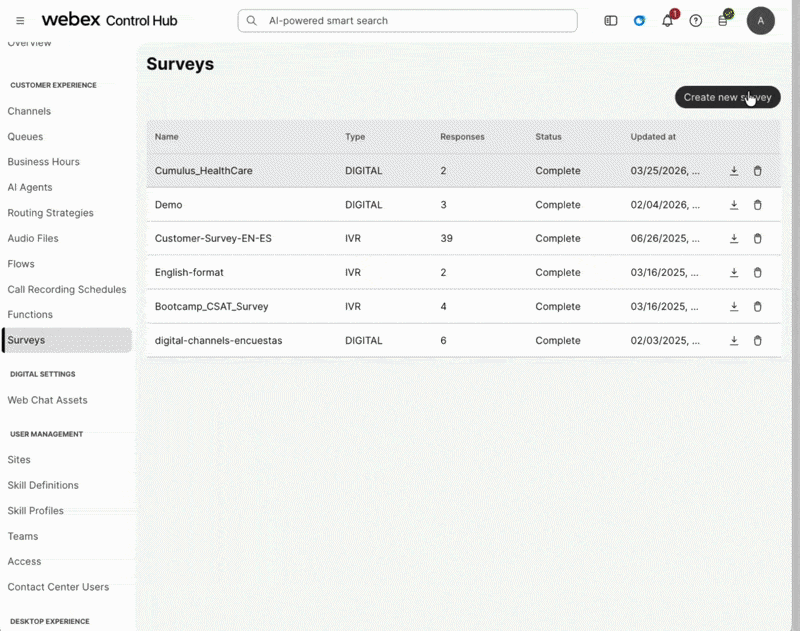{ loading=lazy style="width: 100%; border-radius: 8px; box-shadow: 0 4px 15px rgba(0,0,0,0.2);" }
      <figcaption>Digital Survey Configuration</figcaption>
    </figure>

---

## Phase 2: AI Agent Studio – The "Digital Duo"

Navigate to **Control Hub > Contact Center > Customer Experience > AI Agent** and
click on the black button **Build your AI Agent**.


---

### 2.1 English Agent

**Step 1 Export**

In the search bar, type `UseCase2_English` to locate the AI Agent. <br>
Under **UseCase2_English**, click the **three dots (...)** and select **Export agent**.
This will download the `UseCase2_English.json` file to your local machine. Save it in your **Desktop** folder.

??? tip "See how to Export"
    <figure markdown>
      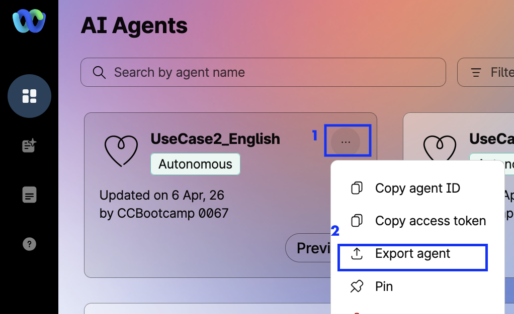{ width="900" }
    </figure>
---

**Step 2 Import**

There in the Studio > Click **Import AI Agent**. Under the **Upload** button,
select the `UseCase2_English.json` file.

---

**Step 3 Naming**

| Field | Value |
|---|---|
| **Name** | PodXXX_UseCase2_English *(Replace XXX with your PodID)*|
| **System ID** | Keep the default |

---

Click **Import**

??? tip "See how to Import"
    <figure markdown>
      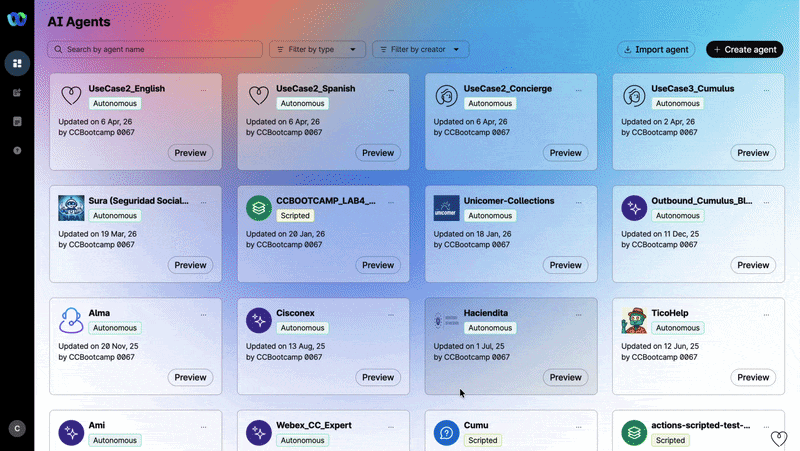{ loading=lazy style="width: 150%; border-radius: 8px; box-shadow: 0 4px 15px rgba(0,0,0,0.2);" }
    </figure>

---

**Step 4 – Knowledge Configuration**

In the **PodXXX_UseCase2_English** AI Agent page, go to the **Knowledge** tab, and configure as follow from the dropdown menu:

| Field | Value |
|---|---|
| **Knowledge Base** | PodXXX_UseCase2_AIAgentCumulus_EN |

!!! warning "Remeber to replace XXX with your PodID"
    Each student has their own Knowledge Base. Selecting the wrong one will break another student's lab.

Click **Save** and then **Publish**. For the comment, use: `V1`

---

**Step 5 – Test**

Use the **Preview** feature in the AI Agent Studio to simulate a live chat. Inside PodXXX_UseCase2_English AI Agent page Select **Preview** and **Start a chat** and verify:

 
- **Identity Capture**: The agent asks for your **name**.
- **Conversational NLU**: Test the agent's ability to handle context by saying: *Hi, I’m currently in Las Vegas on a business trip and I’m feeling under the weather. I don’t feel well and I think I need to get medical assistance*
- **Intent Recognition**: The agent recognizes the **Insurance Forms** intent when you say: *I need some forms*
- **Form Delivery**: The agent provides the correct URL for the requested form.
- **Language Consistency**: The entire interaction remains in **English**.

???- example "Test Script — English"

    | Role | Message |
    |---|---|
    | 🤖 **Prompt** | Hello, I am Pulse from Cumulus Hospital. May I have your name, please, so I can assist you better? |
    | 👤 **User** | Caro |
    | 🤖 **Prompt** | Hello, Caro. I am Pulse from Cumulus Hospital, how can I help you? |
    | 👤 **User** | Hi, I'm currently in Las Vegas on a business trip and I'm feeling under the weather. I don't feel well and I think I need to get medical assistance. |
    | 🤖 **Prompt** | Caro, I'm sorry to hear that you're not feeling well. Cumulus Hospital has a facility in Las Vegas located at 123 Neon Way, Las Vegas, NV 89101. They offer emergency services, MRI, X-Ray, and general surgery. If you need immediate medical attention, please visit this location for assistance. Is there anything else I can help you with today? |
    | 👤 **User** | Yes, I need a form. |
    | 🤖 **Prompt** | Caro, here are the standard forms available: Patient Registration Form · Insurance Claim Form · Authorization Form · Medical Records Release Form. Please let me know which form you need, and I will share the link with you. |
    | 👤 **User** | Patient Registration Form |
    | 🤖 **Prompt** | Thank you, Caro. The form has been shared. Please complete the document and return it to our registration office at your earliest convenience. Here is the Patient Registration Form: **Patient Registration Form 2026**. Is there anything else I can help you with today? |
    
???- tip "See how it works"
    <figure markdown>
        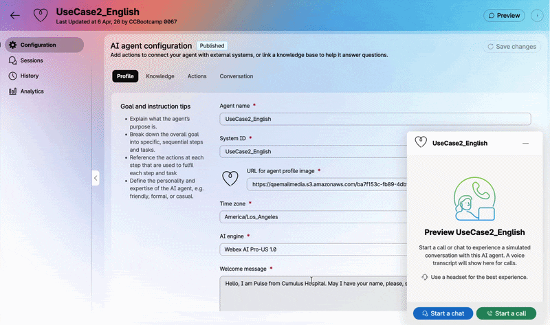{ loading=lazy style="width: 100%; border-radius: 8px; box-shadow: 0 4px 15px rgba(0,0,0,0.2);" }
    </figure>

---

**Step 6 – Session Inspection**

In the **PodXXX_UseCase2_English** AI Agent page, open the **Sessions** tab located on the left-hand navigation menu. Review the most recent session log to confirm the conversation was triggered and processed correctly.

???- tip "See how it works"
    <figure markdown>
      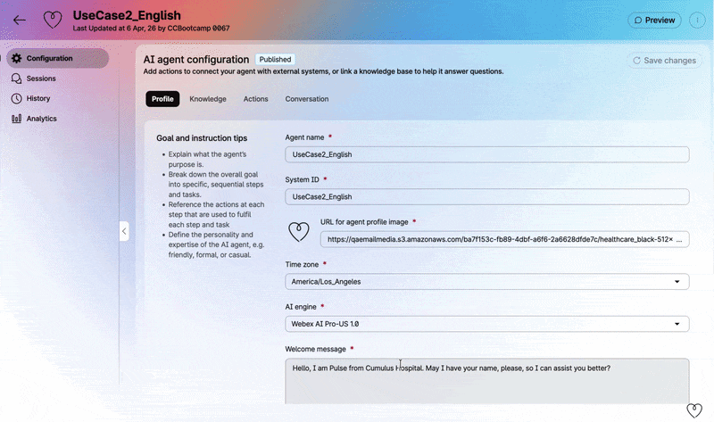{ loading=lazy style="width: 100%; border-radius: 8px; box-shadow: 0 4px 15px rgba(0,0,0,0.2);" }
    </figure>


---

### 2.2 Spanish Agent

**Step 1 – Export**

Under **UseCase2_Spanish** AI Agent, click the **three dots (...)** and select **Export agent**.
This will download the `UseCase2_Spanish.json` file to your local machine.
Save it in your desktop folder.
<br>

---

**Step 2 – Import**

There in the Studio > Click **Import AI Agent**. Under the **Upload** button,
select the `UseCase2_Spanish.json` file.

---

**Step 3 – Naming**

| Field | Value |
|---|---|
| **Name** | PodXXX_UseCase2_Spanish *(Replace XXX with your PodID)* |
| **System ID** | Keep the default |

Click **Import**

---

**Step 4 – Knowledge Configuration**

In the **PodXXX_UseCase2_Spanish** AI Agent page, go to the **Knowledge** tab, and configure as follow from the dropdown menu:

| Field | Value |
|---|---|
| **Knowledge Base** | PodXXX_UseCase2_AIAgentCumulus_ES |

!!! warning "Remeber to replace XXX with your PodID"
    Each student has their own Knowledge Base. Selecting the wrong one will break another student's lab.

Click **Save** and then **Publish**. For the comment, use: `V1`

---

**Step 5 – Test**

Use the **Preview** feature in the AI Agent Studio to simulate a live chat. Inside PodXXX_UseCase2_Spanish AI Agent page Select **Preview** and **Start a chat** and verify:

 
- **Identity Capture**: The agent asks for your **name**.
- **Conversational NLU**: Test the agent's ability to handle context by saying: *Hola, estoy actualmente en Las Vegas en un viaje de trabajo y me siento un poco mal. No me siento bien y creo que necesito recibir asistencia médica*
- **Intent Recognition**: The agent recognizes the **Insurance Forms** intent when you say: *Necesito unos formularios*
- **Form Delivery**: The agent provides the correct URL for the requested form.
- **Language Consistency**: The entire interaction remains in **Spanish**.

???- example "Test Script — Spanish"

    | Role | Message |
    |---|---|
    | 🤖 **Prompt** | Hola, soy Pulso del Hospital Cumulus. ¿Podría decirme su nombre, por favor, para poder asistirle mejor? |
    | 👤 **User** | Caro |
    | 🤖 **Prompt** | Hola, Caro. Soy Pulso del Hospital Cumulus, ¿en qué puedo ayudarle hoy? |
    | 👤 **User** | Hola, estoy actualmente en Las Vegas en un viaje de trabajo y me siento un poco mal. No me siento bien y creo que necesito recibir asistencia médica. |
    | 🤖 **Prompt** | Caro, lamento que no se sienta bien. El Hospital Cumulus cuenta con una sede en Las Vegas ubicada en 123 Neon Way, Las Vegas, NV 89101, donde puede recibir atención médica de emergencia, servicios de rayos X, cirugía general y más. El hospital está abierto de lunes a viernes, de 8:00 a. m. a 6:00 p. m. ¿Le gustaría información sobre cómo llegar, los servicios disponibles o necesita algún formulario específico para su atención? Estoy aquí para ayudarle. |
    | 👤 **User** | Necesito un formulario. |
    | 🤖 **Prompt** | Caro, estos son los formularios estándar que puedo proporcionarle: Formulario de Registro de Paciente · Formulario de Reclamo de Seguro · Formulario de Autorización · Formulario de Liberación de Registros Médicos. ¿Podría indicarme cuál de estos formularios necesita? Así podré compartirle el enlace correspondiente. |
    | 👤 **User** | Formulario de Reclamo de Seguro |
    | 🤖 **Prompt** | Gracias, Caro. Aquí tiene el enlace para descargar el **Formulario de Reclamo de Seguro 2026**. Por favor, complete el documento y devuélvalo a nuestra oficina de registro a la brevedad posible. ¿Hay algo más en lo que pueda ayudarle hoy? |

???- tip "See how it works"
    <figure markdown>
      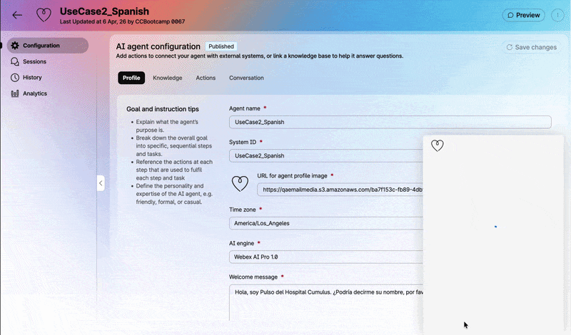
    </figure>


---

## Phase 3: Webex Connect – Flow Orchestration

In this phase, you will "activate" the brain of Cumulus Hospital. You will map the routing logic to the language-specific agents and ensure the patient experience is seamless.

???+ tip "Pro-Tip"
    Think of this flow as the "brain" of Cumulus Hospital. The Digital flow acts as the receptionist, and the routing and decision nodes act as the hallways that direct the patient to the specific specialist who speaks their language.
    <figure markdown>
    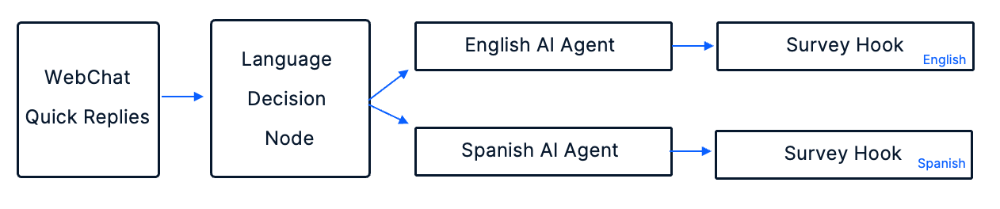{ width="800" }
    </figure>

---

### 3.1 Navigate to Webex Connect

Go to **Control Hub > Contact Center > Quick Links > Digital Channels > Webex Connect**
and navigate to your own service: **PodXXX_LTRCCT2001_CUMULUS**.

!!! warning "Remeber to replace XXX with your PodID"
    Each student has their own Webex Connect Service. Selecting the wrong one will break another student's lab.

---

### 3.2 Open the Flow

Open the **UseCase2_webChat** flow.
You will see the complete architecture for our bilingual digital journey.
Your task is to "activate" the orchestration by mapping the variables and agents.
    <figure markdown>
        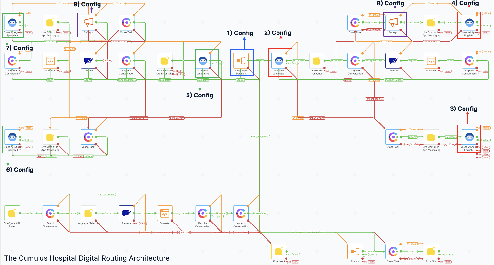{ width="1000" }
    </figure>

***Reference Key:*** Each configuration number shown in the diagram above corresponds directly to the step-by-step instructions provided in the sections below (3.2.1 through 3.2.3). Use this as your reference key to ensure every node is correctly mapped within your Webex Connect flow.

???- tip "After opening the flow you can zoom out to see the same diagram"
    <div style="display: flex; gap: 20px;">
    <figure markdown>
      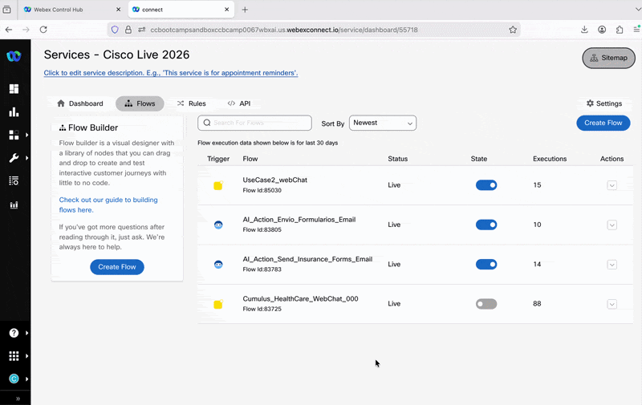{ loading=lazy style="width: 100%; border-radius: 8px; box-shadow: 0 4px 15px rgba(0,0,0,0.2);" }
    </figure>

---

### 3.2.1 Language Decision

Locate the **Language Decision** branch node.

| Number | Node | Color | Action | Function |
|---|---|---|---|---|
| 1 |**Language Decision** | Blue |Configure as follow for English & Spanish Branch | Evaluate the 'receive.message' variable captured by your Quick Replies. This logic directs the patient to the English or Spanish path based on their button selection. |

**For Branch 1**

Open the Language Decision Node, expand the Branch 1 and configure as follow:

| Field | Value |
|---|---|
| **Branch Name** | Change from Branch 1 to **English** |
| **Variable** | $(n2545.receive.message) - leave it as configured |
| **Condition** | Contains ignore case - leave it as configured |
| **Value** | English  |

???- note "See Example — ① Language Decision - English"

    === "① Branch 1 — English"

        <figure markdown>
            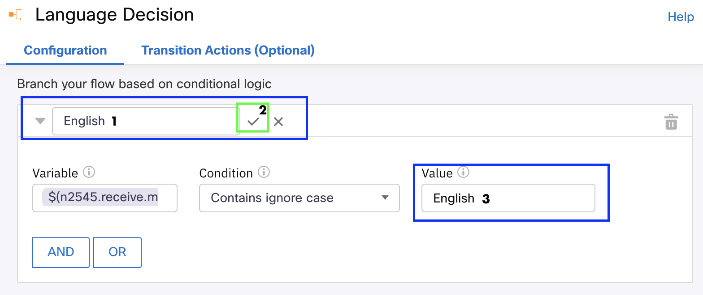{ width="700" }
        </figure>
        > 👆 Rename **Branch 1** to **English** and set the value to **English**.

        !!! tip "After renaming, make sure to click ✅ to save name changes"
    

**For Branch 2**

In the same Language Decision Node, now expand the Branch 2 and configure as follow:

| Field | Value |
|---|---|
| **Branch Name** | Change from Branch 2 to **Spanish** |
| **Variable** | $(n2545.receive.message) - leave it as configured |
| **Condition** | Contains ignore case - leave it as configured |
| **Value** | Español |

After Spanish Branch´s configuration make sure to **Save**

???- note "See Example — ① Language Decision - Spanish"

    === "② Branch 2 — Spanish"

        <figure markdown>
            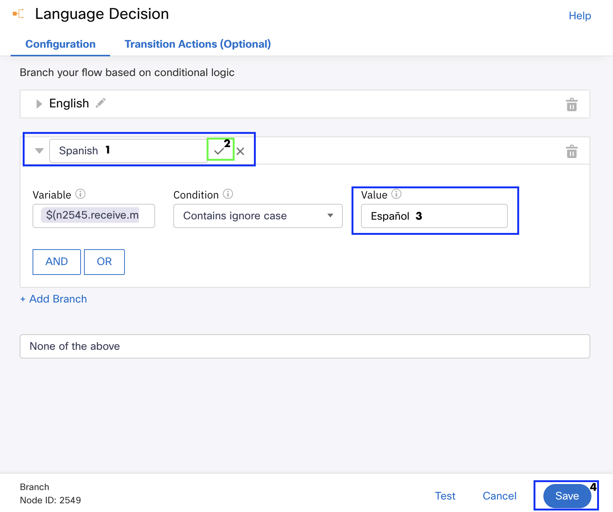{ width="700" }
        </figure>
        > 👆 Rename **Branch 2** to **Spanish** and set the value to **Español**.

        !!! tip "After renaming, make sure to click ✅ to save name changes"
    

**None of the above:** Leave it as it is.

---

### 3.2.2 Language Agent Orchestration

Locate the numbered nodes in your flow, double-click to open each one, and configure them as follows:

| Number | Node | Color | Action | Function |
|---|---|---|---|---|
| 2 | **AI Agent Language1** | Red | <ul><li>Rename node to: AI Agent English</li><li> Select your AI agent PodXXX_UseCase2_English</li><ul> | **English AI Agent** |
| 5 | **AI Agent Language2** |Green | <ul><li>Rename node to: AI Agent Spanish</li><li> Select your AI agent PodXXX_UseCase2_Spanish</li><ul> | **Spanish AI Agent** |

After each configuration make sure to **Save**

???- note "See Example — ② AI Agent English"

    === "② Rename the Node"

        <figure markdown>
            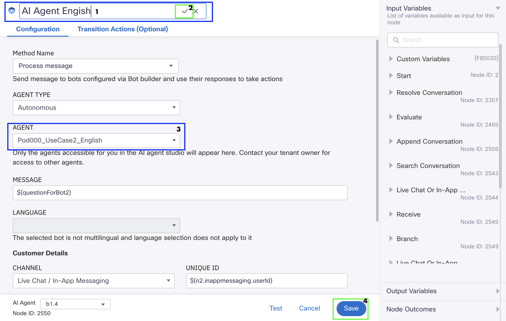{ width="900" }
        </figure>
        > 👆 Rename the node to **AI Agent English** and select **PodXXX_UseCase2_English**.

    !!! tip "After renaming, make sure to click ✅ to save name changes"

???- note "See Example — ⑤ AI Agent Spanish"

    === "⑤ Rename the Node"

        <figure markdown>
            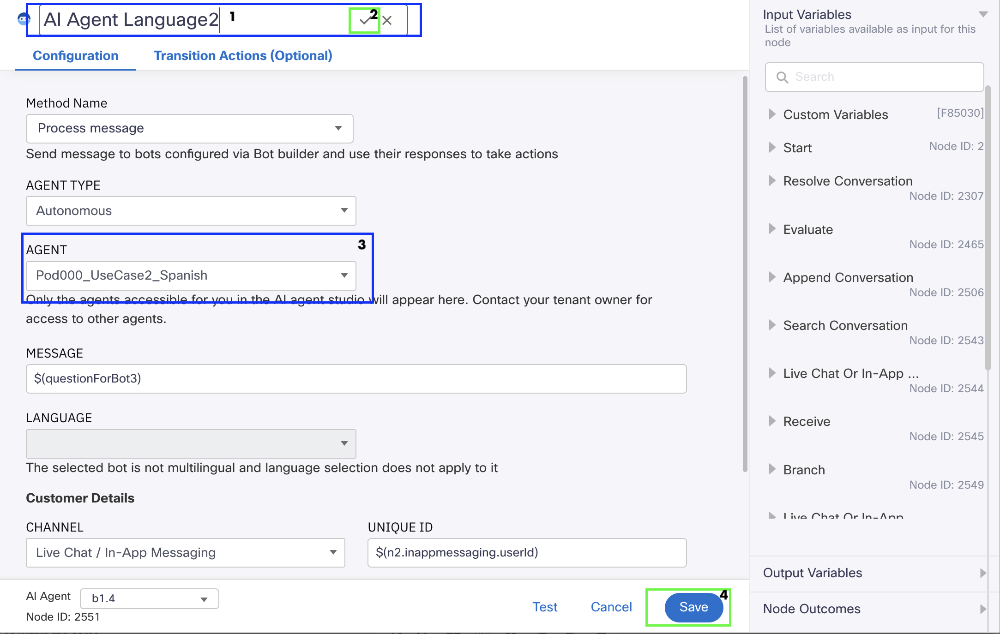{ width="900" }
        </figure>
        > 👆 Rename the node to **AI Agent Spanish** and select **PodXXX_UseCase2_Spanish**.

    !!! tip "After renaming, make sure to click ✅ to save name changes"

---

### 3.2.3 Closing & Survey Hooks

Configure the final nodes to ensure a graceful exit and accurate data collection.
<br>Locate the numbered nodes in your flow, double-click to open each one, and configure them as follows:

**Close AI Agent Nodes**

| Number | Node | Color | Action | Function |
|---|---|---|---|---|
| 3 | **Close AI Agent English 1** | Red | Select PodXXX_UseCase2_English | Ensures session cleanup upon error |
| 4 |**Close AI Agent English 2** | Red | Select PodXXX_UseCase2_English | Handles session closure after survey is presented to the user |
| 6 |**Close AI Agent Spanish 1** | Green | Select PodXXX_UseCase2_Spanish | Ensures session cleanup upon error |
| 7 |**Close AI Agent Spanish 2** | Green | Select PodXXX_UseCase2_Spanish | Handles session closure after survey is presented to the user |

After each configuration make sure to **Save**

???- note "See Example — ③ ④ English Nodes"

    === "③ Close AI Agent English 1"

        <figure markdown>
            { width="900" }
        </figure>
        > 👆 Select **PodXXX_UseCase2_English** — Ensures session cleanup upon error.

    === "④ Close AI Agent English 2"

        <figure markdown>
            { width="900" }
        </figure>
        > 👆 Select **PodXXX_UseCase2_English** — Handles session closure after survey is presented.

???- note "See Example — ⑥ ⑦ Spanish Nodes"

    === "⑥ Close AI Agent Spanish 1"

        <figure markdown>
            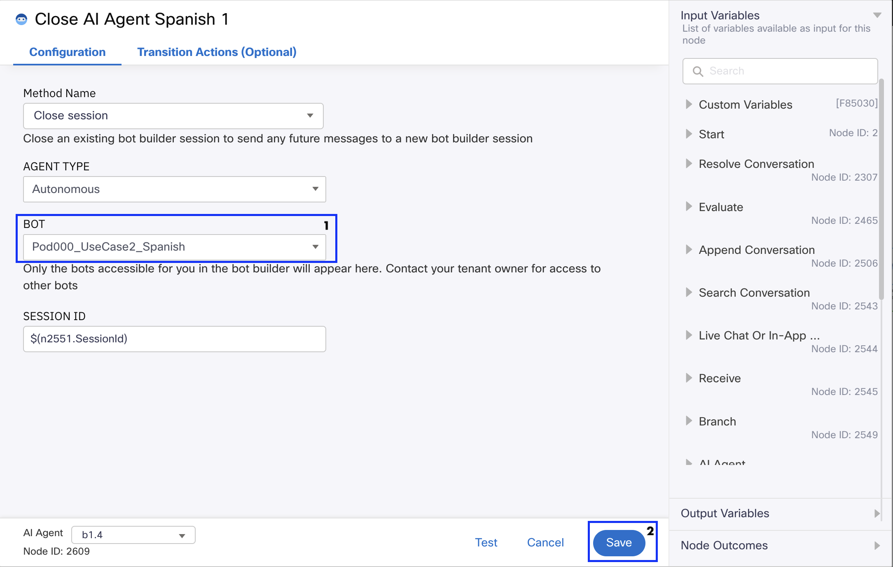{ width="900" }
        </figure>
        > 👆 Select **PodXXX_UseCase2_Spanish** — Ensures session cleanup upon error.

    === "⑦ Close AI Agent Spanish 2"

        <figure markdown>
            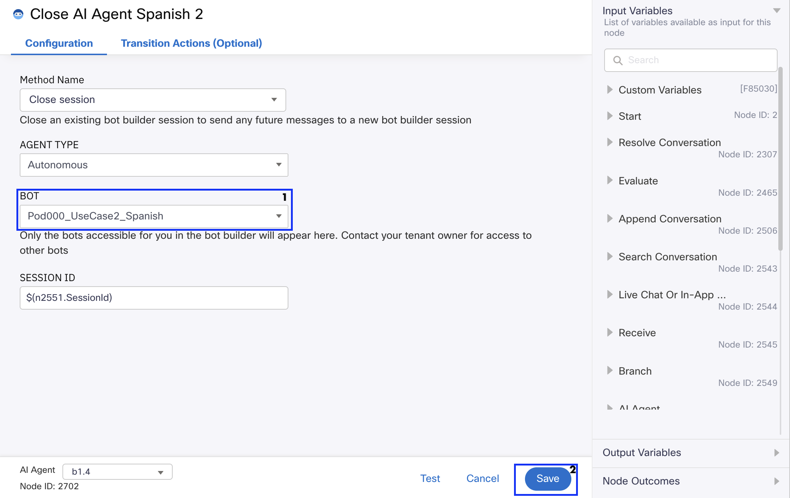{ width="900" }
        </figure>
        > 👆 Select **PodXXX_UseCase2_Spanish** — Handles session closure after survey is presented.

**Survey Hook – English Path**

Locate the numbered node in your flow, double-click to open, and configure it as follows:

 Number | Node | Color | Action | Function |
|---|---|---|---|---|
| 8 | Survey | Purple | set the Preferred Language field to **English** | Triggers English CSAT survey |

After configuration make sure to **Save**

???- note "See Example — ⑧ Survey English"

    <figure markdown>
        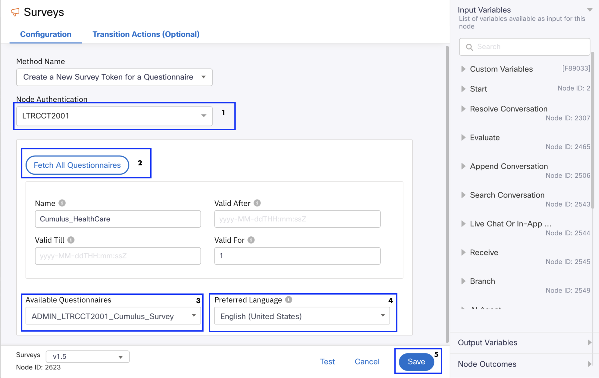{ width="900" }
    </figure>
    > 👆 Set the **Preferred Language** field to **English** to trigger the English CSAT survey.

**Survey Hook – Spanish Path**

Locate the numbered node in your flow, double-click to open, and configure it as follows:

Number | Node | Color | Action | Function |
|---|---|---|---|---|
| 9 | Survey | Purple | set the Preferred Language field to **Spanish** | Triggers Spanish CSAT survey |

After configuration make sure to **Save**

???- note "See Example — ⑨ Survey Spanish"

    <figure markdown>
        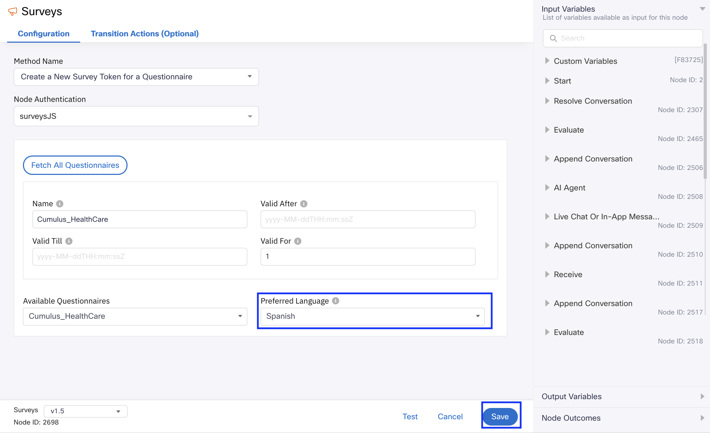{ width="900" }
    </figure>
    > 👆 Set the **Preferred Language** field to **Spanish** to trigger the Spanish CSAT survey.

---

## Phase 4: Web Asset & W3Schools Simulation

### 4.1 Web Chat Asset

!!! note "Before You Begin"
    Ensure you have downloaded the Cumulus Hospital logo to your local machine
    and saved it as **Cumulus_Hospital.png** on your desktop (See [Step 1.2 — Multilingual Survey Creation](#12-multilingual-survey-creation)).

Navigate to **Control Hub > Contact Center > Digital Assets** and locate the asset
**PodXXX_Cumulus_WebChat**, and click on it to open the configuration settings:

**Asset Settings**

Configure as follow:

| Field | Value |
|---|---|
| **Notifications** | Turn on – Play chime sound when user receives a new message |

---

**Website**

Navigate to the **Website** tab, then click **Add Website** to launch the configuration workflow. In the **General** section, configure the following fields:

| Field | Value |
|---|---|
| **Chat widget language** | English |
| **Display name** | Cumulus Hospital |
| **Byline text** | Leave it blank |
| **First message** | Hi! |
| **PCI compliance banner message** | We are committed to protecting your information. This chat is secure and PCI compliant. |
| **Domain** | www.w3schools.com |

**Email transcript:** Leave it as it is configured. Click **Next**.

---

**Appearance tab**
Configure the following fields:

| Field | Value |
|---|---|
| **Widget color** | #0a7ec7 |
| **Widget Button** | Select the first option available |
| **Logo** | Upload Cumulus_Hospital.png from your desktop |
| **Message composer** | Turn on Allow emojis · Turn on Allow attachments |

Click **Next**.

---

**Availability tab**


Click **Save and Next**.

---

**Banned Visitors**

Click **Done**.

???- note "See Example"
    **WebChat**
    <figure markdown>
        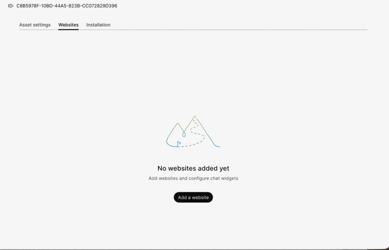{ loading=lazy style="width: 100%; border-radius: 8px; box-shadow: 0 4px 15px rgba(0,0,0,0.2);" }
    </figure>

---

### 4.2 W3Schools Simulation

1. Open the W3Schools HTML Editor at [https://www.w3schools.com/](https://www.w3schools.com/)

2. Click on the **Try it Yourself** button

---

### 4.3 Apply Branded HTML Structure

Apply the recommended branded HTML structure for Cumulus Healthcare. Copy and paste this:
```html
<!DOCTYPE html> 
<html lang="en"> 
<head> 
    <meta charset="UTF-8"> 
    <meta name="viewport" content="width=device-width, initial-scale=1.0"> 
    <title>Cumulus Hospital | Digital Assistant</title> 
    <style> 
        body { 
            font-family: 'Segoe UI', Tahoma, Geneva, Verdana, sans-serif; 
            background-color: #f4f7f9; 
            display: flex; 
            flex-direction: column; 
            align-items: center; 
            padding: 50px; 
            margin: 0; 
        } 
        .header-container { 
            text-align: center; 
            margin-bottom: 30px; 
            background: white; 
            padding: 30px 40px; 
            border-radius: 15px; 
            box-shadow: 0 4px 15px rgba(0,0,0,0.1); 
            width: 100%; 
            max-width: 600px; 
        } 
        .logo-img { 
            width: 120px;
            height: auto; 
            margin-bottom: 15px; 
        } 
        h1 { 
            color: #005073;
            margin: 0; 
            font-size: 28px; 
        } 
        p { 
            color: #56627c; 
            font-size: 1.1em; 
            margin-top: 5px; 
        } 
    </style> 
</head> 
<body> 
    <div class="header-container"> 
         
        <h1>Cumulus Hospital</h1> 
        <p>Digital Patient Care & Virtual Assistant Portal</p> 
    </div> 
  
<!-- Paste here your installation script --> 
  
</body> 
</html>
```

---

### 4.4 Verify Branding

Click **Run** and confirm the page is branded with Cumulus HealthCare information.
???- note "See Example"
    **W3School Try Yourself**
    <figure markdown>
        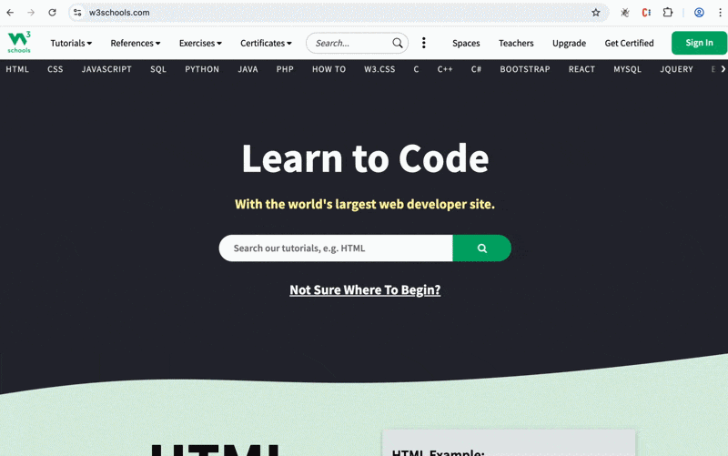{ loading=lazy style="width: 100%; border-radius: 8px; box-shadow: 0 4px 15px rgba(0,0,0,0.2);" }
    </figure>

---

### 4.5 Copy Web Chat Installation Script

Go to **Control Hub > Contact Center > Digital Settings > Web Chat Assets**.
Select your asset **PodXXX_Cumulus_WebChat**, navigate to the **Installation** tab,
and click **Copy**.

???- note "See Example"
    **WebChat Installation Script**
    <figure markdown>
        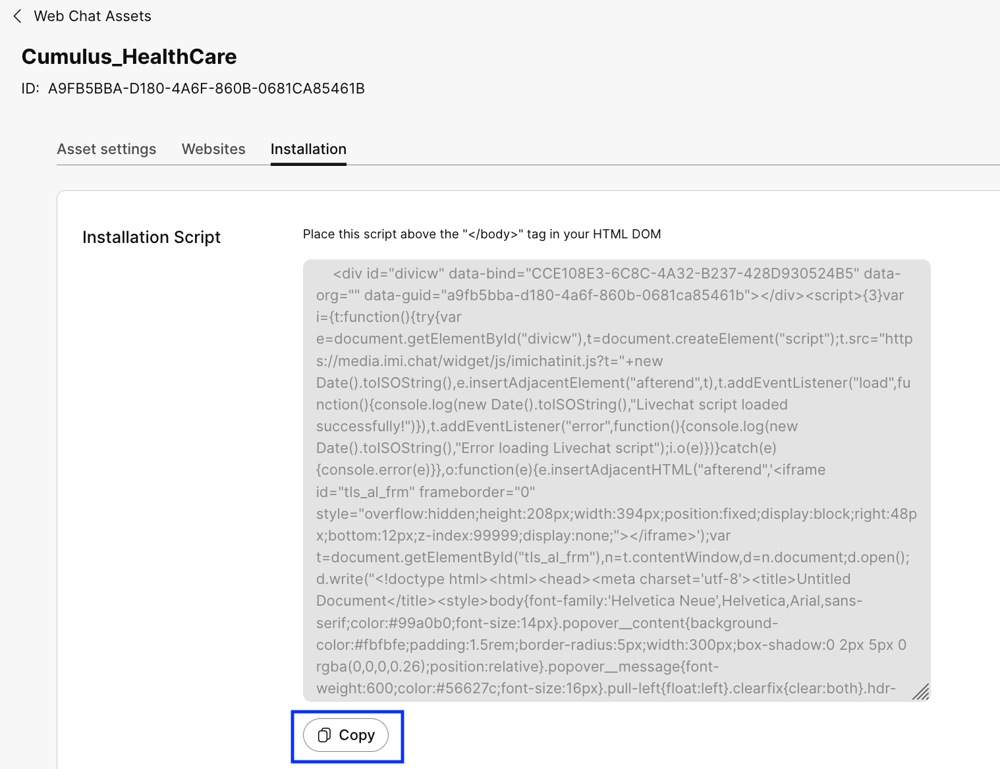{ width="700" }
    </figure>

---

### 4.6 Insert and Run

Insert your **Web Chat Installation Script** (copied in the previous step)
into the W3Schools portal in the space indicated in the HTML script.
<br>| `<!-- Paste here your installation script -->` |

Click **Run**. If the widget appears in the preview pane, you have successfully
connected your Cumulus Hospital portal to Webex Contact Center.

???- note "See Example"
    **W3School with WebChat installed**
    <figure markdown>
        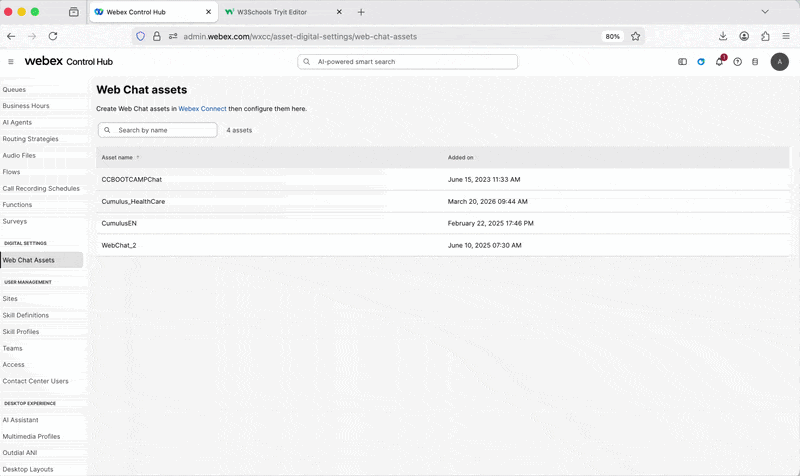{ loading=lazy style="width: 100%; border-radius: 8px; box-shadow: 0 4px 15px rgba(0,0,0,0.2);" }
    </figure>

!!! success
    Your Cumulus Hospital web chat widget is now live and connected to
    Webex Contact Center.

---

## Phase 5: Final Testing

!!! info "The Digital-First Mindset"
    When you test, observe the transition from the Quick Replies to the Language Agent.
    It should be **invisible** to the patient.
    That is the hallmark of a high-quality omnichannel experience.

---
Run the full test **twice** — once in **English**, then in **Spanish**.

**Step 1 – English Test**

!!! example "Test Script – English"
    1. Launch the chat widget
    2. Select **English** and provide your name
    3. Type: *I am in Las Vegas on a business trip and I am not feeling very well, I need assistance*
    4. Wait for the AI Agent response
    5. Ask for a form to get assistance (*Patient Registration Form, Insurance Claim Form, Authorization Form, Medical Records Release Form*)
    6. Verify the agent responds in **English** and provides the correct URL
    7. Wait **60 seconds** and complete the survey

???- note "See Example"
    **English Test**
    <figure markdown>
        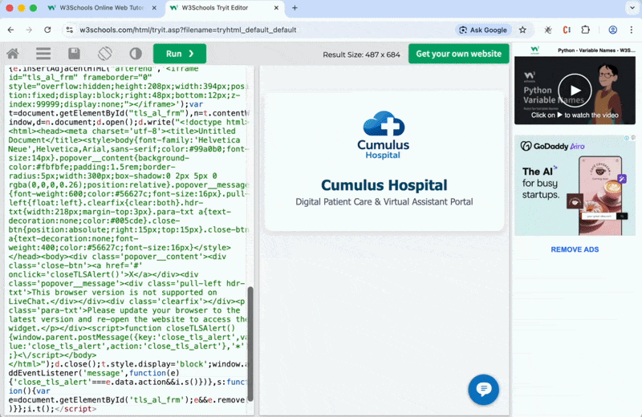{ loading=lazy style="width: 100%; border-radius: 8px; box-shadow: 0 4px 15px rgba(0,0,0,0.2);" }
    </figure>

**Step 2 – Spanish Test**

!!! example "Test Script – Spanish"
    1. Open the chat widget
    2. Select **Spanish** and provide your name
    3. Type: *Estoy en Las Vegas en un viaje de negocios y no me siento muy bien, necesito asistencia*
    4. Wait for the AI Agent's response
    5. Request a form to get assistance  (*Formulario de Registro de paciente, Formulario de reclamo de seguro, Formulario de Autorización, Formulario de liberación de registros médicos*)
    6. Verify that the agent responds in Spanish and provides the correct URL
    7. Wait **60 seconds** and complete the survey

???- note "See Example"
    **Spanish Test**
    <figure markdown>
        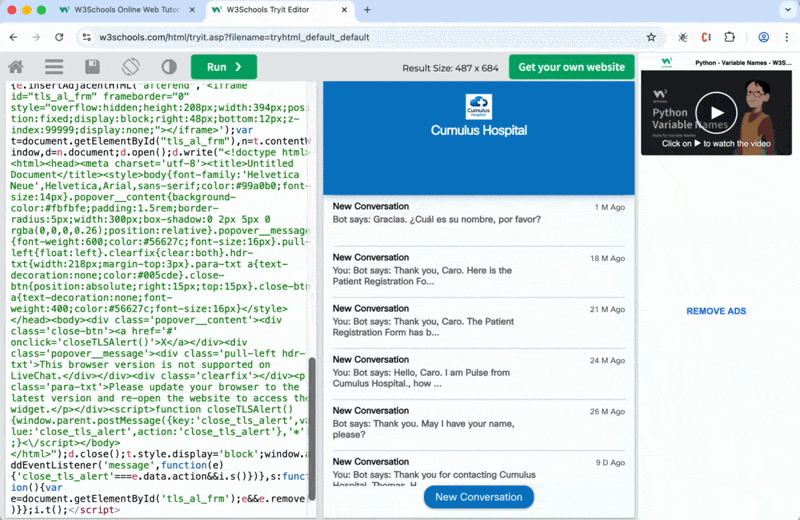{ loading=lazy style="width: 100%; border-radius: 8px; box-shadow: 0 4px 15px rgba(0,0,0,0.2);" }
    </figure>

---

## 🏁 Lab 2 Complete – Congratulations! 🎉

You have successfully completed **Lab 2 – AI Digital-First Multilingual Patient Journey**.

| Component | Status |
|---|---|
| Web Chat Channel | Created and configured |
| Multilingual Survey (EN + ES) | Created and branded |
| English AI Agent | Imported, configured, and published |
| Spanish AI Agent | Imported, configured, and published |
| Webex Connect Flow Orchestration | Configured and activated |
| Web Chat Asset | Configured and branded |
| W3Schools Simulation | Connected and validated |
| End-to-End Testing (EN + ES) | All scenarios validated |

> ✨ *Omnichannel Consistency: You’ve bridged the gap between voice and digital, ensuring Cumulus Hospital provides a seamless experience for every patient.*

If you run into any issues, flag me down. Let’s go!

---

*Lab authored for Cisco Live 2026*

