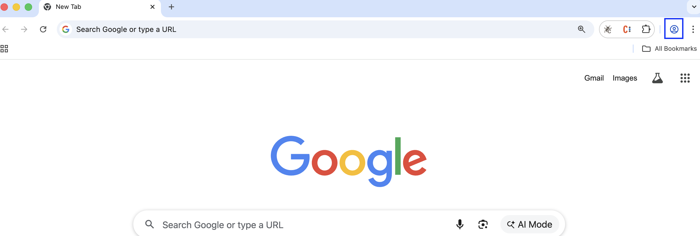
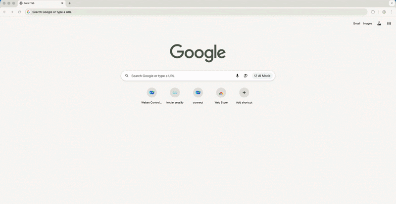
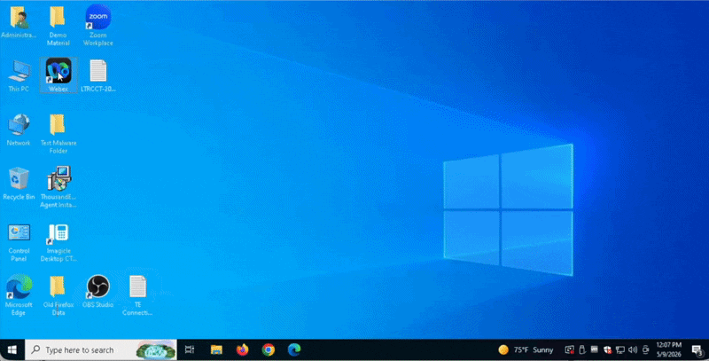

# Getting Started

!!! note "Modular by Design"
    Each lab in this session is **fully independent**. You can complete them 
    in any order based on your interests and available time.

## 1 Disclaimer

Although the lab design and configuration examples provided throughout this session can be used as a reference, for design-related questions please consult the official documentation at [help.webex.com](https://help.webex.com).

## 2 Lab Preparation 

### 2.1 Chrome Profile Setup

To avoid browser login and cache errors, you will work with dedicated Chrome Profiles
representing the different user roles throughout the labs.

#### Profiles to Create
| Profile Name | Role |
|---|---|
| `Admin_Lab` | Administrator |
| `Supervisor_Lab` | Supervisor |
| `Agent_Lab` | Agent |

---

### Steps

1. Launch **Chrome** and locate the **person icon** near the top-right corner of the browser.

???- note "Chrome Profile icon"
    <figure markdown>
      { loading=lazy style="width: 100%; border-radius: 8px; box-shadow: 0 4px 15px rgba(0,0,0,0.2);" }
      <figcaption>Chrome profile icon — top-right corner</figcaption>
    </figure>

2. Click the icon and select **Add Chrome Profile**, then choose **Stay Signed out**.
3. Select a color, enter the profile name (e.g. `Admin_Lab`) and click **Done**.
4. Repeat **steps 2 and 3** to create the two remaining profiles — `Supervisor_Lab`
   and `Agent_Lab`.

???- info "See How It Works"
    <figure markdown>
      { loading=lazy style="width: 100%; border-radius: 8px; box-shadow: 0 4px 15px rgba(0,0,0,0.2);" }
      <figcaption>Creating the three Chrome Profiles for the lab</figcaption>
    </figure>

---
    
## 3 Lab Access

!!! warning "The Pod Discipline — Read Before You Start"
    Throughout all labs, you will be working on a **shared tenant** with all other students
    in this session.

    To keep the environment stable for everyone, please follow these rules:

    - Always replace **XXX** with your assigned **3-digit Pod ID (e.g., 001, 002)**
    - Your naming convention must always start with the prefix **Pod** followed by your
      ID — **(PodXXX)**
    - **Always use the exact name indicated in the lab guide** — do not use different
      names, do not alter the suggested name, do not add extra characters
    - **Do not modify, delete, or overwrite** any resource labeled **ADMIN** or
      **DO NOT DELETE** — those are shared configurations that support the entire lab
    - If you do not follow this convention exactly, you will overwrite your neighbor's
      work

    Stay disciplined. Your Pod ID is your workspace.
---

### 3.1 Lab Credentials
All credentials for this session have been pre-provisioned by the lab proctors.  

Your **pod** has been pre-assigned to a desktop. Please use **one** of the following options to retrieve your credentials:  

  **Option 1 – Lab Assistant (Primary)**  
  If not already open, navigate to the following link in your browser: 
  [https://lab-assistant.com/](https://lab-assistant.com/)

  **Option 2 – Credentials File (Backup)**  
  Open the file **`LTRCCT-2001_Credentials_PODXXX.txt`** located on the **Desktop** of your lab machine.

| Role | Username | Password |
|---|---|---|
| Administrator | `wxcclabs+admin_IDXXX@gmail.com` | Provided in the LTRCCT-2001_Credentials file |
| Agent | `wxcclabs+agent_IDXXX@gmail.com` | Provided in the LTRCCT-2001_Credentials file |
| Supervisor | `wxcclabs+supvr_XXX@gmail.com` | Provided in the LTRCCT-2001_Credentials file |

#### Your credentials file also includes
- 🪪 Your **Pod ID**
- 📞 Your **PSTN Channel Number**
- 🔑 Your **Airtable Authorization Token**

---

!!! info "Action Required — Webex Space"
    Before starting labs, post a message in the **Webex space assigned for this lab**
    with your **Pod ID + Full Name** (e.g., `Pod 001 — Jane Doe`).

    This allows proctors to track assignments and assist you faster throughout the session.

!!! tip "Lost your Airtable Token?"
    If you need your **Airtable Authorization Token** again at any point during the lab,
    request it directly from a proctor in the **Webex lab space**.

---

### 3.2 Making Test Calls - Webex App Setup
#### If you can make US PSTN Calls from your mobile skip this section
If you are unable to place test calls from your mobile device, you can use the **Webex App** pre-installed on your lab machine as your PSTN calling device.
 

1. On your lab machine **Desktop**, locate the **Webex App** icon and double-click
   to open it.
2. Sign in using your **Supervisor credentials** from `LTRCCT-2001_Credentials`.
3. Once logged in, navigate to the **Calling** menu on the left panel.
4. Dial your assigned **Channel PSTN Number** to place a test call into the lab flow.

???- info "See How It Works"
    <figure markdown>
      { loading=lazy style="width: 100%; border-radius: 8px; box-shadow: 0 4px 15px rgba(0,0,0,0.2);" }
      <figcaption>Webex App for PSTN Calls</figcaption>
    </figure>

!!! tip "Earbuds Available at Your Seat"
    A pair of wired earbuds has been provided at your workstation, use them if needed to place calls through the **Webex App** or to handle interactions as an Agent during **Lab 3**.
    🎧 **Keep them — they're yours to take home!**

### 3.3 Lab Quick Links

Bookmark these URLs — you will use them throughout all labs.

| Tool | URL |
|---|---|
| **Collaboration Control Hub** | [admin.webex.com](https://admin.webex.com) |
| **Agent / Supervisor Desktop** | [desktop.wxcc-us1.cisco.com](https://desktop.wxcc-us1.cisco.com/?ciClusterId=P0A1) |

## 4 Lab Environment — Pre-Configured Components

To maximize your lab time, the following components have been pre-configured by the
proctors. **You do not need to set these up.**

| Component | Details |
|---|---|
| **Site** | One site pre-created for the lab environment |
| **Cisco PSTN** | Applied to the lab environment |
| **Teams & Queues** | Pre-created for each Pod |
| **Desktop Profile & Layout** | Pre-configured for the lab environment |
| **Webex Connect Services** | Pre-provisioned for each Pod |
| **Webex Connect Web Chat Asset** | Pre-provisioned for each Pod |
| **Users & Licenses** | Agent and Supervisor users with Contact Center licenses applied for each Pod |
| **Multimedia Profile** | Pre-configured for the lab environment |
| **Wrap-up & Idle Codes** | Pre-configured for the lab environment |
| **AI Assistant Features** | Generated summaries, sentiment analysis, and real-time transcription enabled for the lab environment |

!!! note "Lab-Specific Assets"
    Depending on the lab, additional assets such as **flows, knowledge bases, AI Agents, and other configurations** have been pre-created for each specific use case. These items are explained in detail in the corresponding lab section.

---

*Lab authored for Cisco Live 2026*