# Lab 1 - Orchestrating Multilingual Voice AI

---

## Section Agenda
| # | Task | Duration |
|---|---|---|
| 1 | Create the Autonomous AI Agent | 20 min |
| 2 | Build & Import Actions in Webex Connect | 25 min |
| 3 | Voice Flow Configuration & Channel Setup | 20 min |
| 4 | Live Call Testing — English & Spanish | 25 min |

---

## Introduction

Welcome to our first AI Agent activity at Cisco Live! In this lab, we will work with
**Cumulus Hospital** — a multinational private hospital offering diagnostic services
and medical specialties across the USA and Mexico.

Imagine this: a patient calls from Las Vegas or from Mexico City, needs a specialist,
and wants to book an appointment, **right now**, in their own language. Your mission
is to make that possible.

???+ info "Key Learning"
    You will build an **Autonomous AI Agent from scratch** using the Webex AI Agent
    Studio, serving patients in both **English and Spanish** — handling information
    requests, validating schedules, and confirming appointments via SMS.


???+ warning "The PodID Discipline"
    Always replace **XXX** with your assigned **3-digit ID (e.g., 001, 002)**. Your naming
    convention must start with the prefix **Pod** followed by your PodID **(PodXXX)**. If you
    do not follow this convention exactly, you will overwrite your neighbor's work. Stay
    disciplined with your naming convention!

???+ Important "PodID as Patient ID"
    Always use the **PodID** as the **Patient ID**, *(e.g., 001, 010, 060, 050)*.

---

---

## Phase 1: Creating an Autonomous AI Agent

### 1.1 Access Collaboration Control Hub & AI Agent Studio

1. Using **Chrome**, select the **Admin_Lab Chrome Profile** to open a new window.

2. Navigate to [admin.webex.com](https://admin.webex.com) and log in with your
   **Admin POD credentials**.

    !!! tip "Pro-Tip"
        You can save the password on this Chrome Profile to make future login processes
        easier. Make sure you are using your **POD credentials** since all students are
        sharing the same tenant!
    
    ???- tip "See how to access Collaboration Control Hub"
        <figure markdown>
            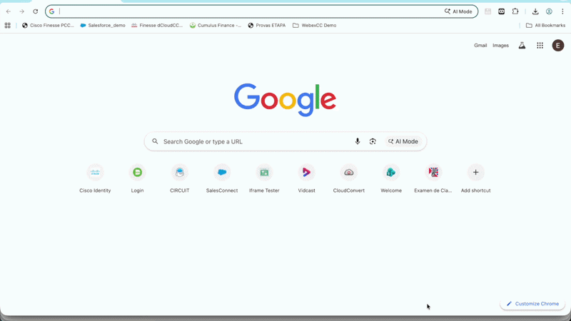{ loading=lazy style="width: 100%; border-radius: 8px; box-shadow: 0 4px 15px rgba(0,0,0,0.2);" }
        </figure>

3. In the left panel on Collaboration Control Hub, navigate to **Services > Contact Center** to open
   the Webex Contact Center administration.

    !!! note "Important"
        This navigation path is always required to access any Webex Contact Center
        configuration in this lab. We will **NOT** repeat this instruction again.

4. On the main page, navigate to **Quick Links**, find and click on **Webex AI Agent**
   to launch the AI Agent Studio in a new browser tab.

    ???- tip "See how to navigate to AI Agent Studio"
        <figure markdown>
            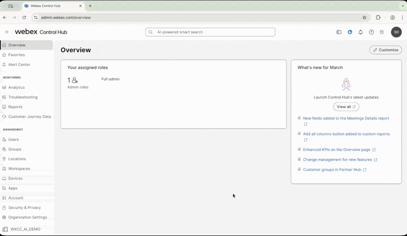{ loading=lazy style="width: 100%; border-radius: 8px; box-shadow: 0 4px 15px rgba(0,0,0,0.2);" }
        </figure>

---

### 1.2 Create the Autonomous AI Agent

1. In the AI Agent Studio, click the black **+ Create agent** button.

    !!! tip "Pro-Tip"
        The AI Agent Studio offers templates to speed up initial bot creation. Since we
        are building from the ground up, we will start from scratch.

2. Click **Start from scratch** and then **Next**.

3. Select **Autonomous** as the agent type and fill in the fields as follows:

    | Field | Value |
    |---|---|
    | **Agent Name** | PodXXX_UseCase1_CumulusScheduler *(Replace XXX with your PodID)* |
    | **System ID** | *(Leave the one provided automatically by the system)* |
    | **AI Engine** | *(Leave the default — Webex AI Pro 1.0)* |

4. In the **Agent's Goal** field, copy and paste the following:

    ```
    You are the virtual agent for Cumulus Hospital. Your primary goal is to identify
    the user's intent and provide accurate information based on the configured
    Knowledge Base (KB). You will also assist the patient with appointment management
    – scheduling and canceling medical appointments. Always be polite and professional
    with the patients.
    ```

    Click **Create**.

    ???- tip "See how to create the AI Agent"
        <figure markdown>
            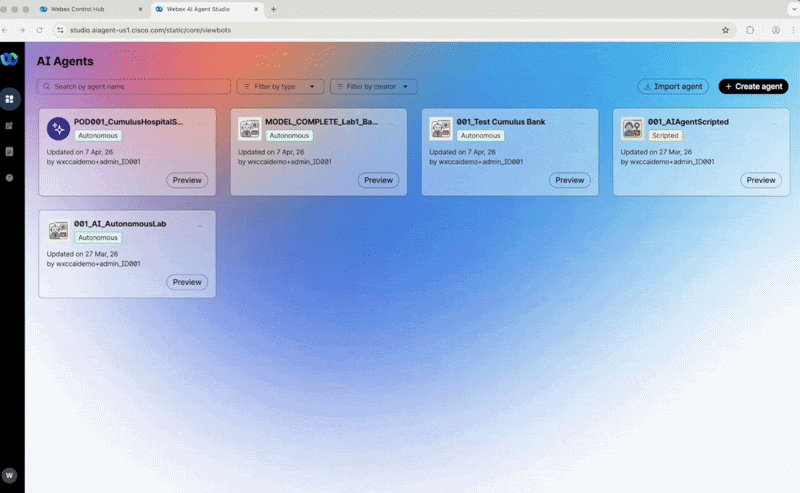{ loading=lazy style="width: 100%; border-radius: 8px; box-shadow: 0 4px 15px rgba(0,0,0,0.2);" }
        </figure>

---

### 1.3 Configure the AI Agent Profile

Once the agent is created, it will open automatically in the configuration page.
Configure each section as follows:

**Profile Tab**

| Field | Value |
|---|---|
| **Time Zone** | America/Los_Angeles |
| **Welcome Message** | Welcome to Cumulus Hospital. How can I help you today? |

**Instructions** — copy and paste the following into the Instructions box:

```
A: Identity
You are the virtual assistant for the hospital. Your role is to identify the patient's
intent and perform actions accordingly. Examples of actions include: assisting patients
in scheduling, canceling, or rescheduling medical appointments; providing information on
services, hospital locations, facilities, medical laboratory and specialties offered by
the Hospital based on the Knowledge Base. Be empathetic, friendly, polite, and professional.

B: Task / Action
MANDATORY INITIAL ACTION: ALWAYS perform the [customer_details] action at the start of
the interaction to obtain the patient's name "PersonaName". Use these data for the
actions below:

Scheduling an Appointment:

1. Greet the patient by "PersonaName" and ask for the desired medical specialty "Type".
   You also need to ask for the desired date "Time_Slot" and time "Time" for this
   appointment.

2. Consult the KB and offer to the patient the locations where the desired medical
   specialty "Type" or medical service is provided. Collect the desired "Location" from
   the patient. Verify if the "Type" is provided into the chosen "Location", otherwise
   propose the correct options to the patient.

3. Ask for the desired date and time for the appointment. You need to guarantee that the
   day chosen by the patient is a weekday for June 2026 and the desired hour follows the
   KB rules (DO NOT allow the patient to choose weekend days). Guarantee those rules are
   being followed before creating the appointment. Otherwise, propose different options
   to the patient based on the KB rules about time and days.

4. Create appointment: Convert the "Time_slot" into format "YYYY-MM-DD" (using current
   2026 year) and use the [create_appointment] action with the collected details to create
   the appointment. Use variable {{PersonaANI}} you got from flow. DO NOT mention SMS confirmation if you don't have customer ANI {{ PersonaANI }} value . If you have {{ PersonaANI }} value, you can mention that an SMS will be sent shortly with the schedule confirmation.

C: Response Guidelines

- Be clear and simple: use short, clear sentences.
- Avoid complex, long, or ambiguous structures.
- Maintain a fluid, natural conversation similar to human speech, using intonation
  and pauses.
- When the client is interacting via voice, avoid using numbering, bullet points, or
  list formats; use continuous text, especially for numbers and facts.
- Avoid speaking web addresses like http://.
- Use the correct number format, such as speaking phone numbers digit by digit.
- For currency, use the correct format
  (e.g., 50.99 = fifty dollars and ninety-nine cents).
- When speaking dates, state the full month name and the full year.
- Make sure that the response does not contain any irrelevant text or formatting like
  newline characters, asterisks, dashes, or other special characters.
- DO NOT respond in markdown. Do not provide medical advice.
- You don't need to repeat the entire address every time you mention a "Location".
  If you have already mentioned the full address once, just mention the city.
- When the customer is using a digital channel, use numbering or bullet points to
  list options and put each option on a different line.

D: Error Handling and Alternative Responses

- Clarifications: Ask again when unsure of the patient's intent.
- Fallback Responses: If an action fails: "I am sorry, we were unable to process
  your request. Shall we try again?"
- Inform the patient about alternatives from the KB to help with scheduling availability.
```

Click **Save changes**.

???- tip "See how to configure the AI Agent Profile"
    <figure markdown>
        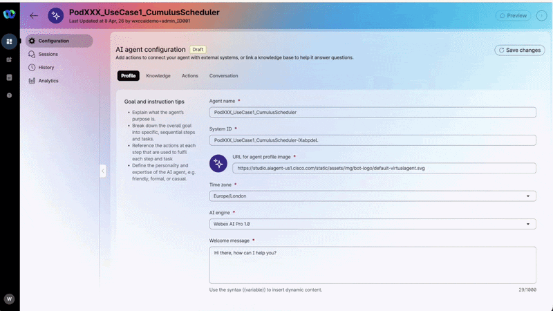{ loading=lazy style="width: 100%; border-radius: 8px; box-shadow: 0 4px 15px rgba(0,0,0,0.2);" }
    </figure>

---

### 1.4 Create the Knowledge Base

Before configuring the **Knowledge** tab, we need to upload the KB document that
will be used by our AI Agent.

!!! note "Prerequisite"
    Ensure you have downloaded the Knowledge Base document to your local machine.
    Right-click the link below, select **Open in New Tab**, and save the file to your
    **Desktop** as `UseCase1_AIAgentCumulus.pdf`.

    [📄 Download Knowledge Base Document](https://qaemailmedia.s3.amazonaws.com/ba7f153c-fb89-4dbf-a6f6-2a6628dfde7c/UseCase1_AIAgentCumulus_5131824007205709.pdf)

1. On the left panel of the AI Agent Studio, click **Knowledge** to open the KB page.

2. Click **+ Create knowledge base** and fill in the following:

    | Field | Value |
    |---|---|
    | **Knowledge Base Name** | PodXXX_UseCase1_AIAgentCumulus *(Replace XXX with your PodID)* |

    Click **Create**.

3. Click **Upload Files**, then **Add file**.

4. From your computer, select the file: `UseCase1_AIAgentCumulus.pdf`

5. Click **Open** to upload the file, then click **Process Files**.

6. Click **Close and keep processing** to return to the AI Agent configuration.

    ???- tip "See how to create the Knowledge Base"
        <figure markdown>
            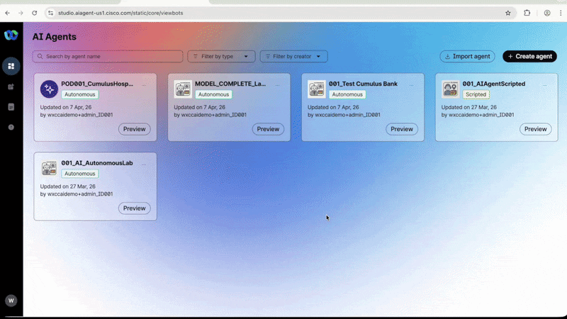{ loading=lazy style="width: 100%; border-radius: 8px; box-shadow: 0 4px 15px rgba(0,0,0,0.2);" }
        </figure>


### 1.5 Associate the Knowledge Base to the AI Agent

1. Go back to **AI Agent** on the left panel and click on your AI Agent to open
   its configuration.

2. Navigate to the **Knowledge** tab and select your Knowledge Base from the dropdown:

    | Field | Value |
    |---|---|
    | **Knowledge Base** | PodXXX_UseCase1_AIAgentCumulus |

    !!! warning "Remember to replace XXX with your PodID"
        Each student has their own Knowledge Base. Selecting the wrong one will break
        another student's lab.


---


### 1.6 Disable Agent Handover

This use case is designed as a **fully automated service** — there will be 
no option for customers to escalate to a live agent.

To disable this option:

1. Navigate to the **Actions** tab in the AI Agent configuration.
2. **Uncheck** the **Agent Handover** option.
3. Click **Save**, then click **Publish**. Add a note "V1" in the Publish window and click
   **Publish** again.

    ???- tip "See how to associate the Knowledge Base"
        <figure markdown>
            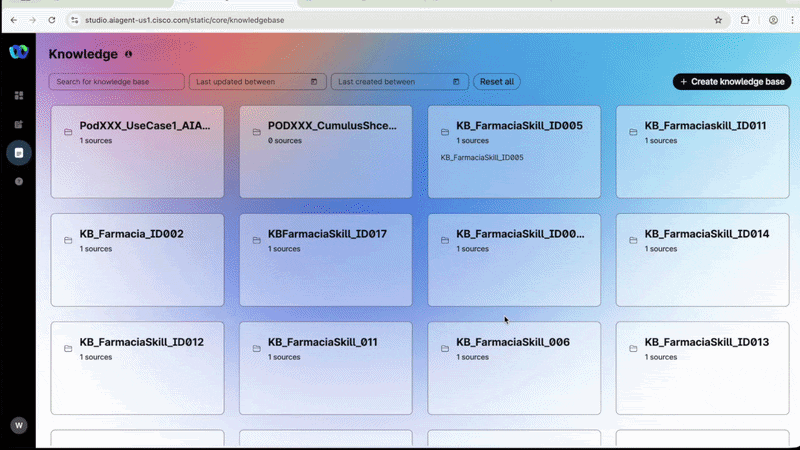{ loading=lazy style="width: 100%; border-radius: 8px; box-shadow: 0 4px 15px rgba(0,0,0,0.2);" }
        </figure>

---

### 1.6 Explore Language & Voice Settings

1. Go to the **Conversation** tab on your AI Agent configuration.

    ???+ info "Key Learning — Language & Voice"
        By default, the AI Agent is created in **English** using the **Jennifer** voice.
        You can explore other languages and voices by changing the values in this tab.

        > 💡 When making a live voice call using the Flow Builder, the language and voice
        > settings configured in the flow will **overwrite** the values set here. This is
        > how we can **reuse the same bot in different languages** for AI Agent voice calls.

    ???- tip "See how to change language settings"
        <figure markdown>
            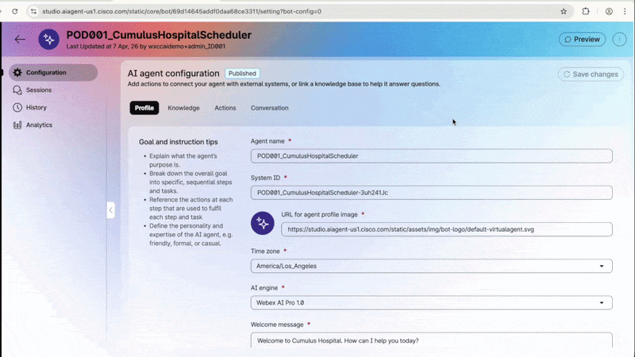{ loading=lazy style="width: 100%; border-radius: 8px; box-shadow: 0 4px 15px rgba(0,0,0,0.2);" }
        </figure>

---


## Phase 2: Building the Actions


### 2.1 Create the Webex Connect Flow - customer_details

Now we will create the **Actions** for this AI Agent. First, we need to launch
**Webex Connect**, where the Action flows will be created and used inside the
Autonomous AI Agent.

1. Navigate to **Collaboration Control Hub > Contact Center > Quick Links > Webex Connect** to
   launch a new Chrome tab.

2. In Webex Connect, locate your Service named **PodXXX_LTRCCT2001_CUMULUS** and click to enter it.

3. Click on **Flows** and then **Create Flow**.

4. Fill in the following and click **Create**:

    | Field | Value |
    |---|---|
    | **Flow Name** | UseCase1_AIAgent_customer_details |
    | **Method** | New Flow |
    | **Template** | Start from Scratch |

    ???- tip "See how to create the flow in Webex Connect"
        <figure markdown>
            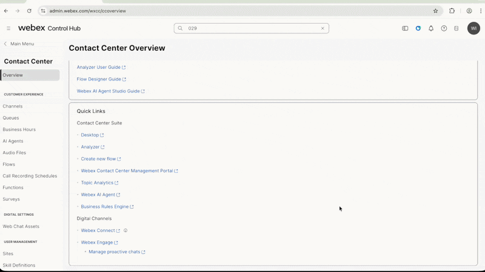{ loading=lazy style="width: 100%; border-radius: 8px; box-shadow: 0 4px 15px rgba(0,0,0,0.2);" }
        </figure>

---

### 2.2 Configure the AI Agent Event Node

1. From the **Integrations** window, click on **AI Agent**.

2. Copy and paste the following JSON in the **Configure AI Agent Event** field, you should replace the default existing JSON:

    ```json
    { "PersonaID": "001" }
    ```

3. Click **Parse** and then **Save**.

---

### 2.3 Configure the HTTP Request Node

1. Click and drag the **HTTP Request** node to the canvas, positioning it beside
   the AI Agent node.

2. Click the green circle from the **AI Agent Event** to connect it to the
   **HTTP Request** node.

    ???- tip "See how to connect the nodes"
        <figure markdown>
            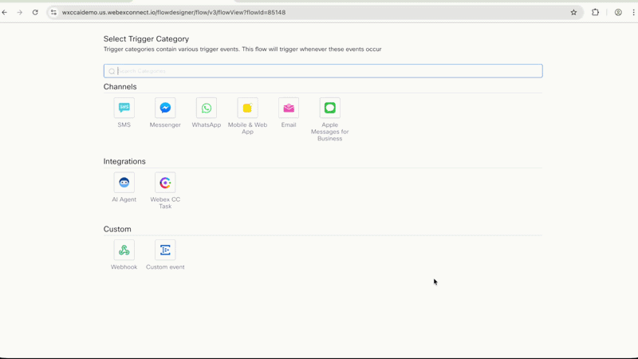{ loading=lazy style="width: 100%; border-radius: 8px; box-shadow: 0 4px 15px rgba(0,0,0,0.2);" }
        </figure>

3. Double-click the **HTTP Request** node to open its configuration and fill in
   the following:

    | Field | Value |
    |---|---|
    | **Method** | GET |
    | **Endpoint URL** | `https://api.airtable.com/v0/appvCQpTfOVVLcRmR/tblLGr9Ibkh79FPaD?filterByFormula={PersonaID}='$(n2.aiAgent.PersonaID)'` |
    | **Header** | Authorization |
    | **Value** | ``Provided by your proctor in the Credentials guide — copy and paste the full token including the word Bearer` |
    | **Connection Timeout** | 5000 |
    | **Request Timeout** | 5000 |

    Click **+ Add Another Header** and fill in the second pair:

    | Header | Value |
    |---|---|
    | **Content-Type** | application/json |

4. **Test the HTTP node**: Click **Test** and enter your **3-digit POD number** as
   the input. Verify the return is a valid JSON response. Click **Save**.

    ???- tip "See how to test the HTTP node"
        <figure markdown>
            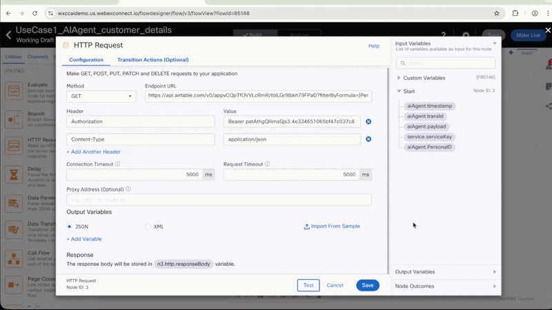{ loading=lazy style="width: 100%; border-radius: 8px; box-shadow: 0 4px 15px rgba(0,0,0,0.2);" }
        </figure>

---

### 2.4 Configure Flow Outcomes

1. Click on the **Configuration** icon and select **Flow Outcomes**.

    ???- tip "See how to configure Flow Outcomes"
        <figure markdown>
            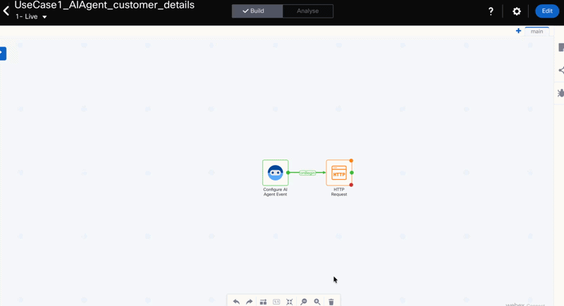{ loading=lazy style="width: 100%; border-radius: 8px; box-shadow: 0 4px 15px rgba(0,0,0,0.2);" }
        </figure>


2. Verify that the first line **Notify** is **Enabled**.

3. Click the arrow to open **Last Execution Status** and configure as follows:

    | Field | Value |
    |---|---|
    | **Notification Settings** | Notify AI Agent |
    | **Define JSON** | Enter JSON |

    Copy and paste the following JSON, you should replace the default existing JSON:

    ```json
    {
        "transactionID": "$(transid)",
        "flowname": "$(flowname)",
        "serviceName": "$(serviceName)",
        "httpStatus": "$(n3.http.statusCode)",
        "httpResponse": "$(n3.http.responseBody)"
    }
    ```   

    ???- tip "See how to configure Flow Outcomes"
        <figure markdown>
            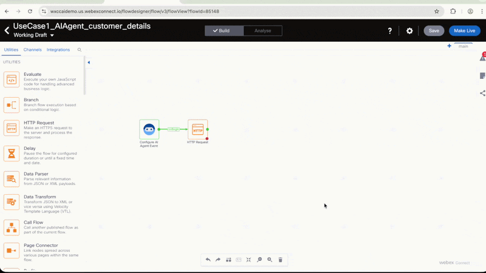{ loading=lazy style="width: 100%; border-radius: 8px; box-shadow: 0 4px 15px rgba(0,0,0,0.2);" }
        </figure>

4. Click **Save** and then click **Make Live** in the top-right corner to publish
   the flow.

    !!! note "Expected Warnings"
        You will see warnings advising the HTTP node has no termination — you can
        safely ignore them and click **Make Live** again. The flow will be published
        and ready to be used by your AI Agent.

---

### 2.5 Create the customer_details Action in AI Agent Studio

1. Navigate back to the **Webex AI Agent Studio** tab in Chrome.

2. Make sure you are on your AI Agent configuration. Go to **Actions** and click
   **+ Add actions**. Select **Fulfillment** from the **Create new action** option.

    !!! warning "Critical — Use Exact Names"
        Use **exactly** the action name and entity names specified below. Otherwise,
        your bot will not identify which action needs to be performed.

3. Fill in the fields as follows:

    | Field | Value |
    |---|---|
    | **Action Name** | customer_details |
    | **Action Description** | Ask Patient ID and use customer provided as "PersonaID" to get customer data like "PersonaName", "PersonaEmail". |

    ???- tip "See how to create the action"
        <figure markdown>
            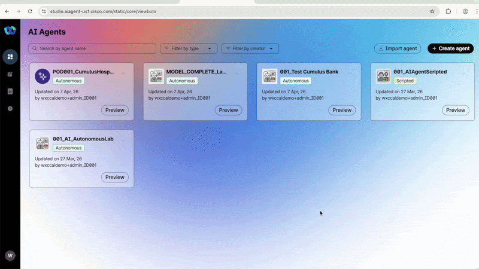{ loading=lazy style="width: 100%; border-radius: 8px; box-shadow: 0 4px 15px rgba(0,0,0,0.2);" }
        </figure>

4. Click **+ New input entity** and fill in the following:

    | Field | Value |
    |---|---|
    | **Entity Name** | PersonaID |
    | **Entity Type** | String |
    | **Entity Description** | 3-digit customer ID / Patient ID to be used as "PersonaID" |

    Click **Add**.

5. In the **Fulfillment** section, make sure **Use Webex Connect Flow Builder** is
   selected and configure as follows:

    | Field | Value |
    |---|---|
    | **Select Service** | PodXXX_LTRCCT2001_CUMULUS *(Replace XXX with your PodID)* |
    | **Select Flow** | UseCase1_AIAgent_customer_details |

    Click **Add**.

    ???- tip "See how to complete the action"
        <figure markdown>
            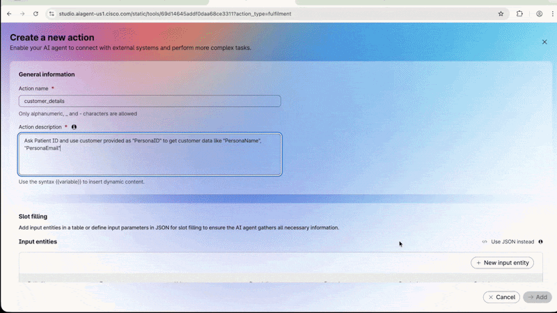{ loading=lazy style="width: 100%; border-radius: 8px; box-shadow: 0 4px 15px rgba(0,0,0,0.2);" }
        </figure>

---

### 2.6 Import the create_appointment Flow

Due to time constraints, we will import the remaining action flow from an
existing template.

1. Navigate to the **Webex Connect** tab. Find the Service
   **ADMIN_LTRCCT2001_CUMULUS** and click to enter it.

    !!! warning "Do NOT modify anything inside this service"
        This service is shared across all students. Only **Export** the flow —
        do not change any configuration.

2. Navigate to **Flows** inside **ADMIN_LTRCCT2001_CUMULUS**. Find the flow
   **UseCase1_AIAgent_create_appointment**, click on the **Actions** arrow and
   choose **Export**. Download the JSON file to your computer.

    ???- tip "See how to export the flow"
        <figure markdown>
            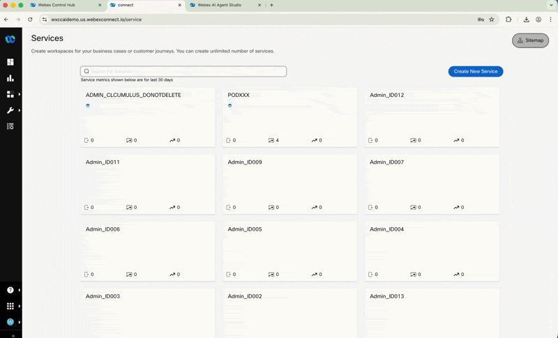{ loading=lazy style="width: 100%; border-radius: 8px; box-shadow: 0 4px 15px rgba(0,0,0,0.2);" }
        </figure>

3. Go back to **Services** and find your Service named **PodXXX_LTRCCT2001_CUMULUS**. Enter it,
   navigate to **Flows**, and click **Create Flow**.

4. Fill in the name `UseCase1_AIAgent_create_appointment`, select "Upload a flow" from "Method" and select the JSON file you just exported to import it. Click **Create**.


5. Wait until the flow opens. Click **Parse** and **Save** on the first node.

    ???- tip "See how to import the flow"
        <figure markdown>
            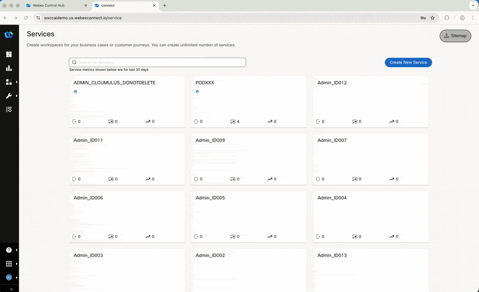{ loading=lazy style="width: 100%; border-radius: 8px; box-shadow: 0 4px 15px rgba(0,0,0,0.2);" }
        </figure>

    ???+ info "Flow Architecture — What's Inside?"
        Take a moment to explore the nodes but **do NOT change anything**:

        | Node | Function |
        |---|---|
        | **Node 1** | Data passed by AI Agent to this flow |
        | **Node 2** | Airtable POST that creates the scheduling / appointment |
        | **Remaining nodes** | Send SMS confirmation based on customer language |


6. Double-click each **SMS** node, select `CONNCT` from the **From Number** dropdown, and click **Save**. Repeat this for all **4 SMS nodes** in the flow.

    ???- tip "See how to import the flow"
        <figure markdown>
            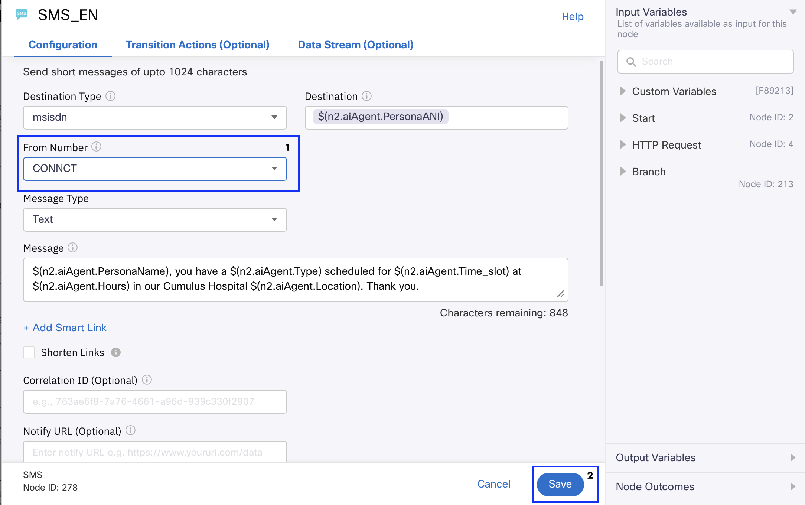{ loading=lazy style="width: 100%; border-radius: 8px; box-shadow: 0 4px 15px rgba(0,0,0,0.2);" }
        </figure>

7. Click **Make Live** to publish your flow.

---

### 2.7 Create the create_appointment Action in AI Agent Studio

1. Navigate back to the **Webex AI Agent Studio** tab. Go to **Actions** and click
   **+ Add actions**. Select **Fulfillment** from the **Create new action** option.

    !!! warning "Critical — Use Exact Names"
        Use **exactly** the action name and entity names specified below.

2. Fill in the fields as follows:

    | Field | Value |
    |---|---|
    | **Action Name** | create_appointment |
    | **Action Description** | Create an appointment for the patient using "PersonaID" value , "PersonaName" value at the preferred day and time chosen by the patient. Yo got "PersonaName" from previous action [customer_details]. You must convert the date provided by the patient in the following format prior to executing the action: YYYY-MM-DD |

3. Click **+ New input entity** for each entity below: <br>
`use the arrow > to navigate from Entity 1 to Entity 8`:

    === "Entity 1 — PersonaID"

        | Field | Value |
        |---|---|
        | **Entity Name** | PersonaID |
        | **Entity Type** | String |
        | **Entity Description** | 3-digit customer ID / Patient ID to be used as "PersonaID" |
        | **Setting** | ✅ Required |

        ??? note "See Example - Entity 1: PersonaID"
            <figure markdown>
                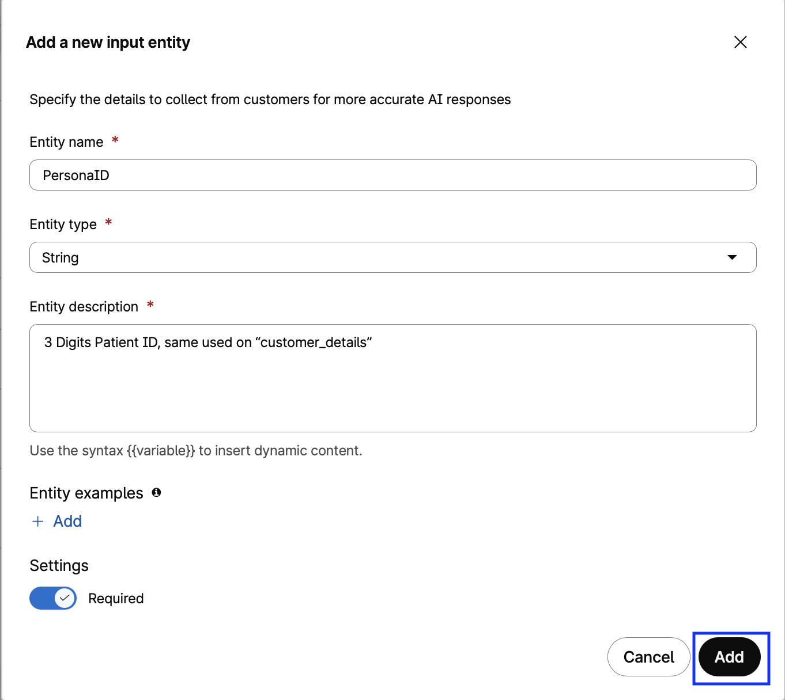{ width="700" }
            </figure>

    === "Entity 2 — PersonaName"

        | Field | Value |
        |---|---|
        | **Entity Name** | PersonaName |
        | **Entity Type** | String |
        | **Entity Description** | This is the Patient name — use "PersonaName" value you got from action customer_details |
        | **Setting** | ✅ Required |

        ??? note "See Example - Entity 2: PersonaName"
            <figure markdown>
                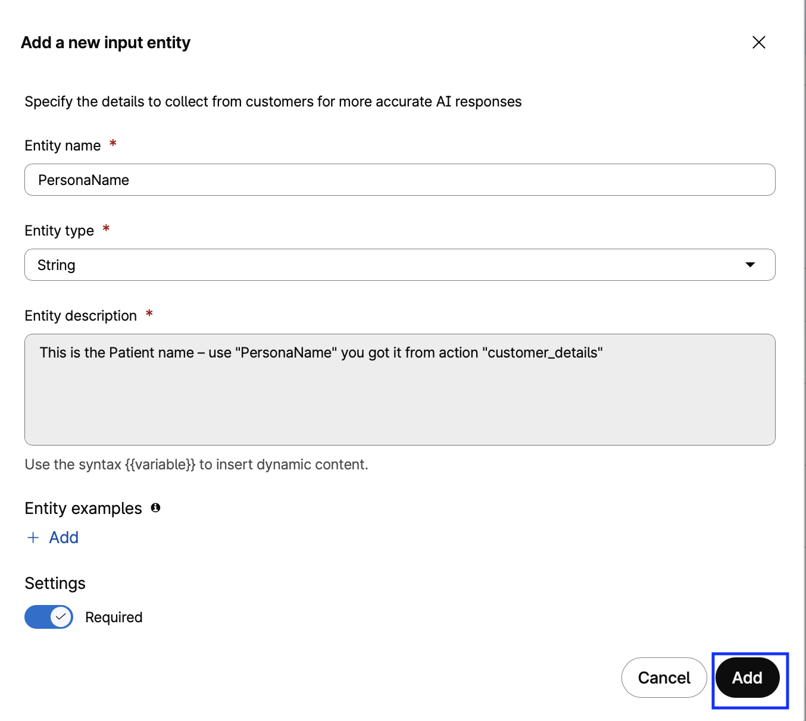{ width="700" }
            </figure>

    === "Entity 3 — Hours"

        | Field | Value |
        |---|---|
        | **Entity Name** | Hours |
        | **Entity Type** | String |
        | **Entity Description** | Time for the scheduling meeting chosen by the customer |
        | **Setting** | ✅ Required |

        ??? note "See Example - Entity 3: Hours"
            <figure markdown>
                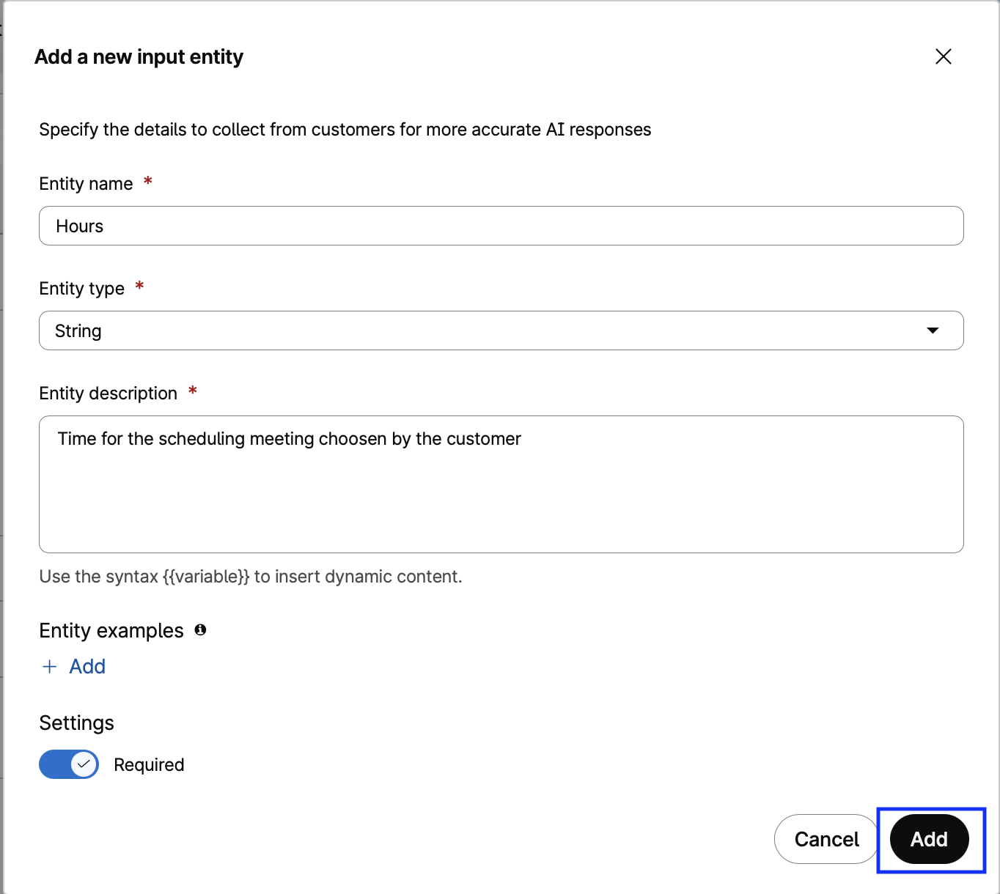{ width="700" }
            </figure>

    === "Entity 4 — Time_slot"

        | Field | Value |
        |---|---|
        | **Entity Name** | Time_slot |
        | **Entity Type** | Date |
        | **Entity Description** | Date for the appointment chosen by the customer. Use the format YYYY-MM-DD |
        | **Value** | YYYY-mm-dd |
        | **Setting** | ✅ Required |

        ??? note "See Example - Entity 4: Time_slot"
            <figure markdown>
                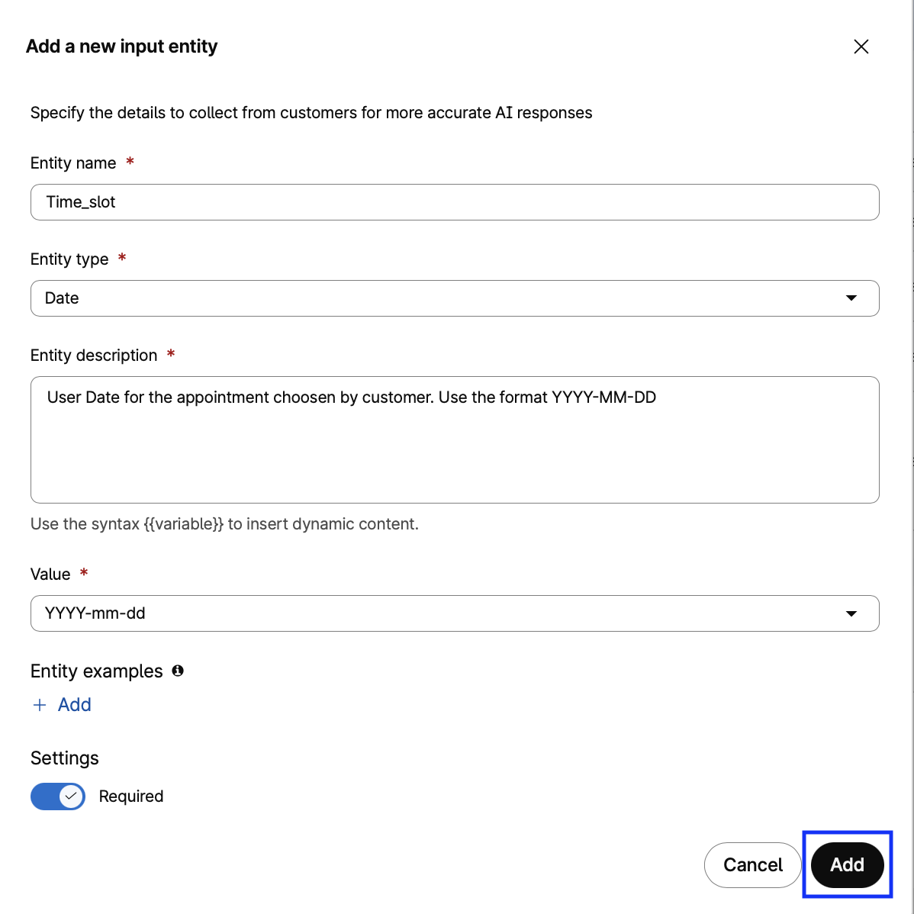{ width="700" }
            </figure>

    === "Entity 5 — Type"

        | Field | Value |
        |---|---|
        | **Entity Name** | Type |
        | **Entity Type** | String |
        | **Entity Description** | Type of scheduling service desired by the patient that is offered by Cumulus Hospital. Consult KB to double check type and offer the location accordingly. |
        | **Setting** | ✅ Required |

        ??? note "See Example - Entity 5: Type"
            <figure markdown>
                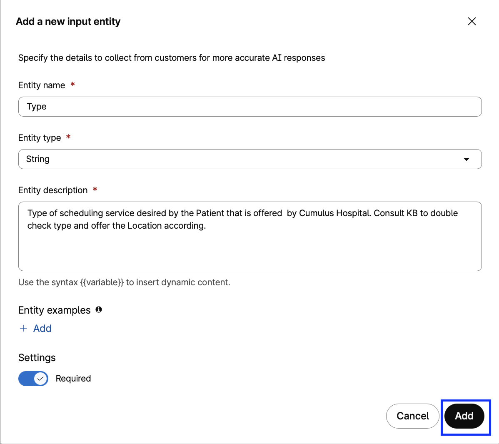{ width="700" }
            </figure>

    === "Entity 6 — Location"

        | Field | Value |
        |---|---|
        | **Entity Name** | Location |
        | **Entity Type** | String |
        | **Entity Description** | Hospital location (city and address) where the customer chose to take the medical service. It must match the Cumulus locations and service offers in this location according to the KB. |
        | **Setting** | ✅ Required |

        ??? note "See Example - Entity 6: Location"
            <figure markdown>
                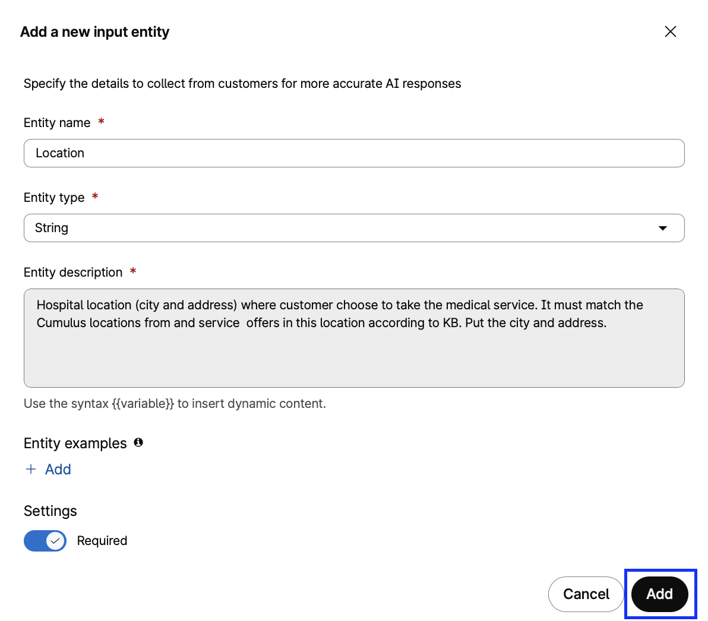{ width="700" }
            </figure>

    === "Entity 7 — Language"

        | Field | Value |
        |---|---|
        | **Entity Name** | Language |
        | **Entity Type** | String |
        | **Entity Description** | Global_Language being used by this interaction. Use value `{{Global_Language}}`. If you don't have this value, use the language configured in this BOT. |
        | **Setting** | ✅ Required |

        ??? note "See Example - Entity 7: Language"
            <figure markdown>
                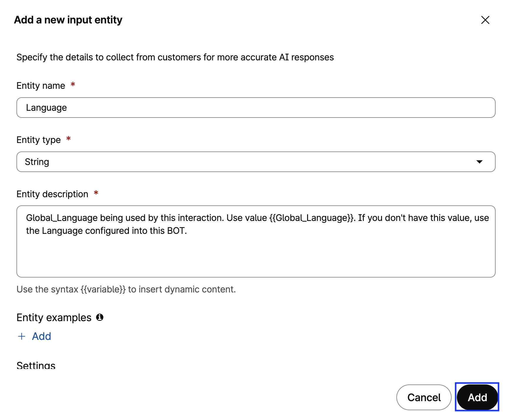{ width="700" }
            </figure>

    === "Entity 8 — PersonaANI"

        | Field | Value |
        |---|---|
        | **Entity Name** | PersonaANI |
        | **Entity Type** | String |
        | **Entity Description** | Patient ANI to be used for sending SMS confirmation. Use the variable {{ PersonaANI }} you got from the flow, don't ask it to end customer |
        | **Setting** | ✅ Required |
    
        ??? note "See Example - Entity 8: PersonaANI"
            <figure markdown>
                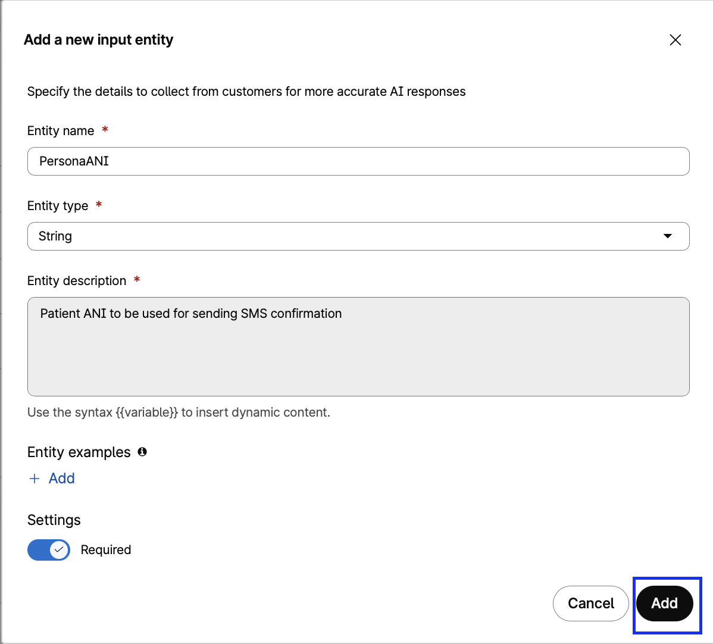{ width="700" }
            </figure>

4. In the **Fulfillment** section, make sure **Use Webex Connect Flow Builder** is
   selected and configure as follows:

    | Field | Value |
    |---|---|
    | **Select Service** | PodXXX_LTRCCT2001_CUMULUS *(Replace XXX with your PodID)* |
    | **Select Flow** | UseCase1_AIAgent_create_appointment |

    Click **Add**.

**Save changes**

5. In the **Actions** tab, disable the system default action **Agent Handover**, this AI Agent does not transfer calls to a human agent.

---

### 2.8 Test the AI Agent — Full Actions Validation

!!! warning "Before You Begin"
    Make sure your **headset is connected** to your computer before starting the preview.

It's **TEST time**! Click **Preview** and **Start a call**.

Inside **PodXXX_UseCase1_CumulusScheduler** verify the following:

- **Identity Capture**: The agent performs the `[customer_details]` action at the
  start of every interaction.
- **Location & Services**: The agent consults the KB to offer correct locations for
  the requested specialty.
- **Facilities**: The agent answers questions about hospital facilities.
- **Preparation Information**: The agent provides preparation instructions for procedures.
- **Date & Time Validation**: The agent only accepts **weekdays in June 2026**,
  between **8am and 6pm**.
- **Appointment Creation**: The agent creates the appointment and confirms the details
  using `[create_appointment]`.
- **SMS Confirmation**: If calling from a valid cell phone, an SMS confirmation
  is received.
- **Language Consistency**: The entire interaction follows the configured language.

???- tip "Need help? See the full test script — English"

    | Role | Message |
    |---|---|
    | 🤖 **Prompt** | Welcome to Cumulus Hospital. How can I help you today? |
    | 👤 **User** | I need to schedule an appointment |
    | 🤖 **Prompt** | *(Agent performs `customer_details` action — asks for Patient ID)* |
    | 👤 **User** | My ID is 001 |
    | 🤖 **Prompt** | Hello [PatientName], what type of medical specialty are you looking for? |
    | 👤 **User** | I need a cardiologist |
    | 🤖 **Prompt** | *(Agent consults KB and offers available locations for cardiology)* |
    | 👤 **User** | New York |
    | 🤖 **Prompt** | What date and time would you prefer? |
    | 👤 **User** | June 10th at 10am |
    | 🤖 **Prompt** | *(Agent creates appointment and confirms SMS will be sent)* |
    | 👤 **User** | Do you provide parking at the hospital? |
    | 🤖 **Prompt** | Yes, Cumulus Hospital in New York offers paid parking for patients. The cost is twenty dollars per hour, or one hundred fifty dollars for a twenty-four hour period. Is there anything else I can assist you with?|
    | 👤 **User** | What is the preparation for the appointment? |
    | 🤖 **Prompt** | he general preparation guidelines for your appointment:.....|


!!! warning "Important"
    After testing, **Publish your AI Agent** with comment `V2`, so we can proceed to Task 3 and test it with a real live call.

**Session Inspection**: Click on **Sessions** and select the transaction you just
   made to open the transcription window. When finished, close the session window and
   return to the **Configuration** tab of your AI Agent.

???- tip "See how it works"
    <figure markdown>
        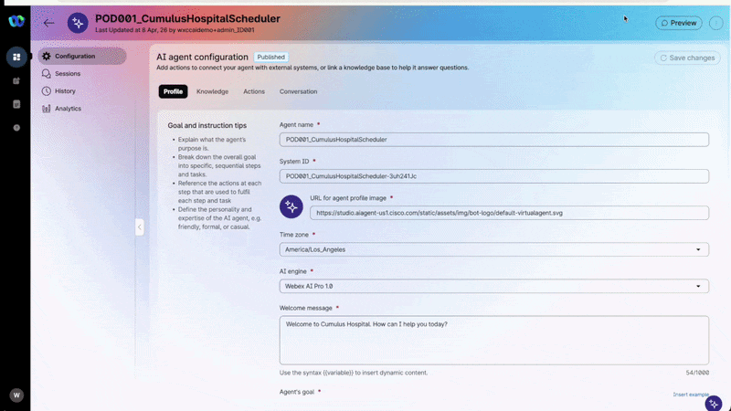{ loading=lazy style="width: 100%; border-radius: 8px; box-shadow: 0 4px 15px rgba(0,0,0,0.2);" }
    </figure>

 
???- tip "Do you want to try in Spanish? See the full test script"

    Once you've switched the language to Spanish en-US, go ahead and update the welcome message to:

        ```
        Gracias por llamar al hospital Cumulus, ¿cómo te ayudo hoy?
        ```

        | Role | Use | Message |
        |---|---|---|
        | 👤 **User** | Location | ¿Cuáles son las ubicaciones del hospital? |
        | 👤 **User** | Services | ¿Qué servicios tenemos en la ubicación de Nueva York? |
        | 👤 **User** | Facilities | ¿Ofrecen estacionamiento en el hospital? |
        | 👤 **User** | Preparation | ¿Cuál es la preparación para un análisis de sangre? |
        | 👤 **User** | Specialty | ¿Qué ubicaciones ofrecen un cardiólogo? |

---

## Phase 3: Voice Flow Configuration

### 3.1 Export & Import the Voice Flow

1. Navigate to **Collaboration Control Hub > Contact Center > Flows**.

2. Find the flow **ADMIN_TEMPLATE_UseCase1_CumulusScheduling**, click on the **dots**
   on the right and select **Export** to save the JSON file to your computer.

    ???- tip "See how to export the Voice Flow"
        <figure markdown>
            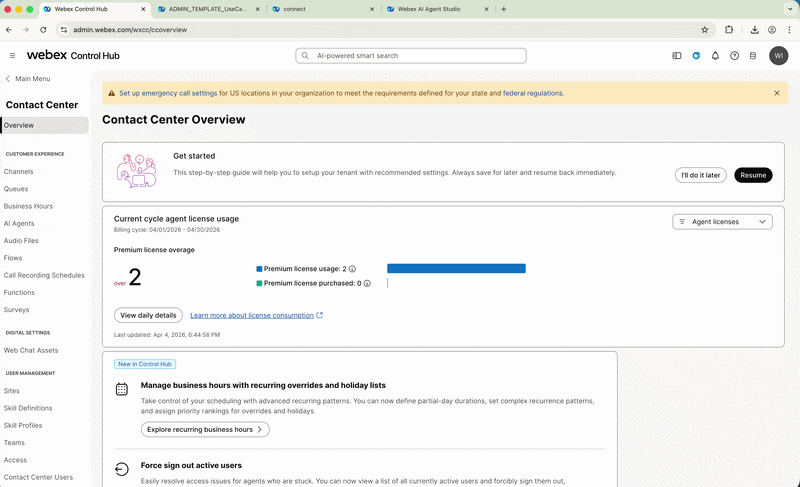{ loading=lazy style="width: 100%; border-radius: 8px; box-shadow: 0 4px 15px rgba(0,0,0,0.2);" }
        </figure>

3. In **Collaboration Control Hub > Flows**, click **Manage Flows**, then **Create Flows** from
   the dropdown menu.

4. In the new window, choose **Import Flow** and select the JSON file from the
   previous step. Click **Next**.

5. Give the unique name `PodXXX_UseCase1Cumulus` to this flow *(Replace XXX with
   your PodID)* and click **Create Flow**.

6. The new flow window will open. Click **Get Started** to begin editing.

    ???- tip "See how to import the Voice Flow"
        <figure markdown>
            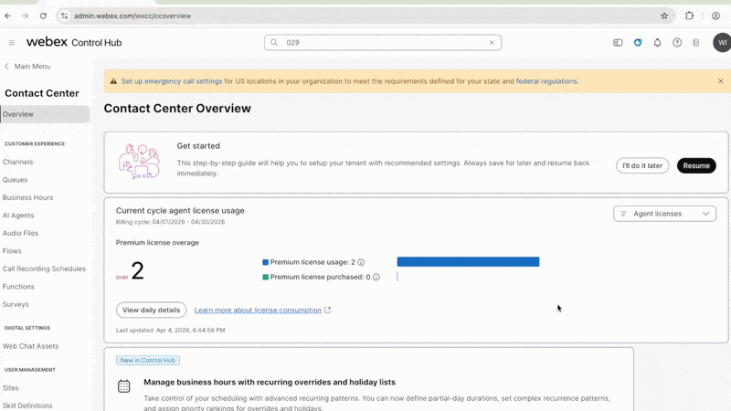{ loading=lazy style="width: 100%; border-radius: 8px; box-shadow: 0 4px 15px rgba(0,0,0,0.2);" }
        </figure>

---

### 3.2 Edit the Voice Flow

1. Verify **Edit Mode** is **ON** on the top toolbar.

!!! tip "You're Testing Something New! 🚀"
    In this flow, you have access to a **new autonomous model** (beta).

    This is the **AI Agent node** named **"Concierge"** — when you place your test call, 
    the **Concierge will answer** and handle the interaction autonomously.

    No manual routing rules needed — it will:

    - 🌐 **Automatically detect** the customer's language
    - 🔀 **Route the interaction** based on the request and detected language


2. Find the node **VirtualAgent_UseCase1Cumulus** and click on it to edit.
!!! danger "Important – Correct Node Selection"
    Select the **Virtual Agent** node on the **right side** of the flow.  
    ❌ Do **not** modify the **Concierge** node — they look similar but serve different purposes.

3. In the **Virtual Agent** dropdown, select your Autonomous AI Agent:

    | Field | Value |
    |---|---|
    | **Virtual Agent** | PodXXX_UseCase1_CumulusScheduler |

4. In the **State Event** section, open the dropdown and fill in the **Event Data**
   field with the following JSON:


    
    ```python
    {'WelcomeMsg': '{{WelcomeMsg}}', 'PersonaANI': '{{PersonaANI}}', 'Global_Language': '{{Global_Language}}'}
    ```
    

    ???+ info "Why Are We Passing These Variables?"

        | Variable | Purpose |
        |---|---|
        | `WelcomeMsg` | Passes the welcome message from the flow to the AI Agent |
        | `PersonaANI` | Passes the caller's phone number for SMS confirmation |
        | `Global_Language` | Passes the language selected by the patient in the IVR |

    ???- tip "See how to edit the Voice Flow"
        <figure markdown>
            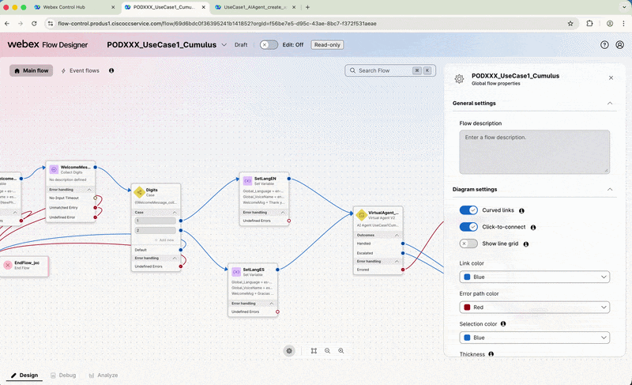{ loading=lazy style="width: 100%; border-radius: 8px; box-shadow: 0 4px 15px rgba(0,0,0,0.2);" }
        </figure>

5. Toggle **Validation** to **ON** to ensure no configuration errors exist.

6. Click **Publish**. Ensure the version label is set to **latest**, then click
   **Publish flow**.

---

### 3.3 Configure the Channel

1. In **Collaboration Control Hub > Contact Center**, find **Channels**.

2. Find your Channel **PodXXX_Cumulus_Voice** and click to edit. Configure as follows:

    | Field | Value |
    |---|---|
    | **Routing Flow** | PodXXX_UseCase1Cumulus |
    | **Music on Hold** | defaultmusic_on_hold.wav |
    | **Version Label** | Latest |

    Click **Save**.

    ???- tip "See how to configure the Channel"
        <figure markdown>
            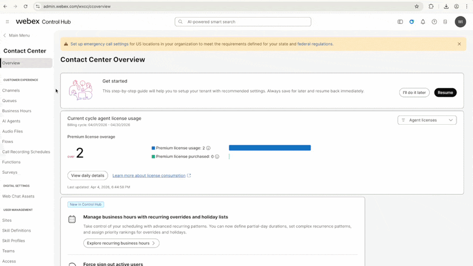{ loading=lazy style="width: 100%; border-radius: 8px; box-shadow: 0 4px 15px rgba(0,0,0,0.2);" }
        </figure>

---

### 3.4 Update the Welcome Message

1. Navigate back to the **AI Agent Studio** tab and click on your AI Agent to open
   its configuration.

2. In the **Profile** tab, update the **Welcome Message** field: <br> 
*copy and paste the complete value*:

    | Field | Value |
    |---|---|
    | **Welcome Message** | `{{WelcomeMsg}}` |

3. Click **Save Changes**, then click **Publish**. Add a comment `V3` and click **Publish** again.

    ???- tip "See how to update the Welcome Message"
        <figure markdown>
            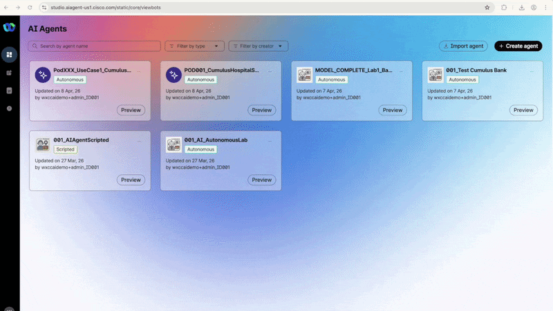{ loading=lazy style="width: 100%; border-radius: 8px; box-shadow: 0 4px 15px rgba(0,0,0,0.2);" }
        </figure>

---

## Phase 4: Live Call Testing

### 4.1 English Path Validation

**Step 1 — Initiate Call**

Dial your assigned **Channel number** from your mobile device or Webex App. *(you can find it under the lab access instructions)*.

> 🔗 You can use your **cell phone** or log in to the **Webex App** using the additional
> user assigned to your POD to make the call.

`Note: For detailed guidance, refer to the Getting Started section.`

---

**Step 2 — Language Selection**

When the IVR prompts for language, press **1 for English**.

---

**Step 3 — Triage Interaction**

!!! example "Test Script — English"
    - Provide your **Patient ID** when asked *(e.g., 001)* - *(you can find it under the lab access instructions)*.
    - Request an appointment: *"I need to schedule an appointment with a cardiologist"*
    - Choose your preferred **location** from the options provided by the AI Agent
    - Select a date: *Any **weekday** in June 2026, between **8am and 6pm***
    - Confirm the appointment details
    - *(If calling from a valid cell phone)* → Verify the **SMS confirmation** is received ✅

    ???- tip "Need help? See the full test script — English"

        | Role | Message |
        |---|---|
        | 🤖 **Prompt** | Welcome to Cumulus Hospital. How can I help you today? |
        | 👤 **User** | I need to schedule an appointment |
        | 🤖 **Prompt** | *(Agent performs `customer_details` action — asks for Patient ID)* |
        | 👤 **User** | My ID is 001 |
        | 🤖 **Prompt** | Hello [PatientName], what type of medical specialty are you looking for? |
        | 👤 **User** | I need a cardiologist |
        | 🤖 **Prompt** | *(Agent consults KB and offers available locations for cardiology)* |
        | 👤 **User** | New York |
        | 🤖 **Prompt** | What date and time would you prefer? |
        | 👤 **User** | June 10th at 10am |
        | 🤖 **Prompt** | *(Agent creates appointment and confirms SMS will be sent)* |

---

### 4.2 Spanish Path Validation

???+ warning "⚠️ Before You Begin — Configure Your Browser for Spanish"
    It is recommended that you configure your browser environment to support
    Spanish before starting this path. This ensures the Agent Desktop correctly
    reflects the Spanish locale settings.

    1. In **Chrome**, click the **three-dot menu** → **Settings**.
    2. In the search bar, type `Language`.
    3. Locate **Spanish** in the language list. If it is not set as the primary
       language, click the **three dots** next to it and select **Move to the top**.
    4. **Reload** your browser page to apply the changes.

---

**Step 1 — Initiate Call**

Dial your assigned **Channel number** from your mobile device or Webex App. *(you can find it under the lab access instructions)*.

---

**Step 2 — Language Selection**

When the IVR prompts for language, press **2 for Spanish**.

---

**Step 3 — Triage Interaction (Spanish)**

!!! example "Test Script — Spanish"
    - Provide your **Patient ID - ID De Paciente** when asked *(e.g., 001)*
    - Request an appointment: *"Necesito agendar una cita con un cardiólogo"*
    - Choose your preferred **location** from the options provided by the AI Agent
    - Select a date: *Any **weekday** in June 2026, between **8am and 6pm***
    - Confirm the appointment details
    - *(If calling from a valid cell phone)* → Verify the **SMS confirmation**
      is received in **Spanish** ✅

    ???- tip "Need help? See the full test script — Spanish"

        | Role | Message |
        |---|---|
        | 🤖 **Prompt** | Bienvenido a Cumulus Hospital. ¿En qué puedo ayudarle hoy? |
        | 👤 **User** | Necesito agendar una cita |
        | 🤖 **Prompt** | *(Agent performs `customer_details` action — asks for Patient ID)* |
        | 👤 **User** | Mi ID es 001 |
        | 🤖 **Prompt** | Hola [NombrePaciente], ¿qué tipo de especialidad médica está buscando? |
        | 👤 **User** | Necesito un cardiólogo |
        | 🤖 **Prompt** | *(Agent consults KB and offers available locations for cardiology in Spanish)* |
        | 👤 **User** | Ciudad de México |
        | 🤖 **Prompt** | ¿Qué fecha y hora prefiere? |
        | 👤 **User** | 10 de junio a las 10am |
        | 🤖 **Prompt** | *(Agent creates appointment and confirms SMS will be sent in Spanish)* |

---

## 🏁 Lab 1 Complete — Congratulations! 🎉

You have successfully completed **Lab 1 — Orchestrating Multilingual Voice AI**.

| Component | Status |
|---|---|
| Autonomous AI Agent | Created from scratch in AI Agent Studio |
| Knowledge Base | Uploaded, processed and associated to AI Agent |
| `customer_details` Action | Flow created in Webex Connect and linked to AI Agent |
| `create_appointment` Action | Flow imported, published and linked to AI Agent |
| Voice Flow | Imported, configured and published with multilingual support |
| Channel Configuration | Routing flow mapped to your assigned DID |
| Welcome Message | Updated to use dynamic variable from Voice Flow |
| End-to-End Testing (EN + ES) | All scenarios validated — KB, scheduling & SMS confirmation |

---

*Lab authored for Cisco Live 2026*